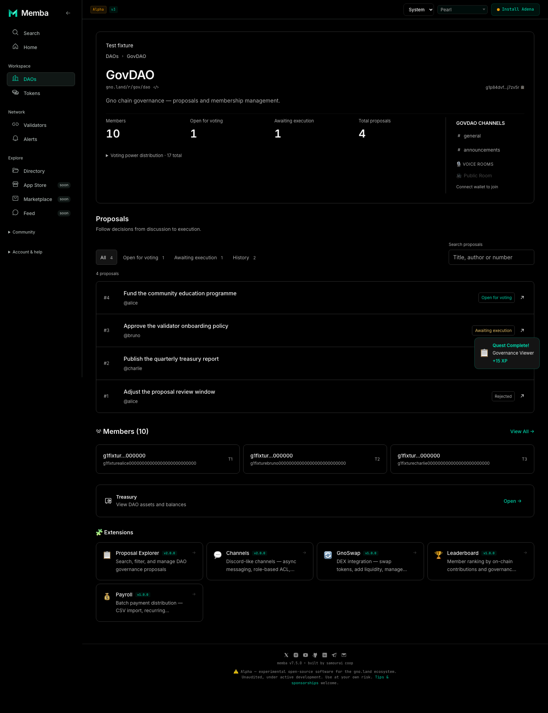
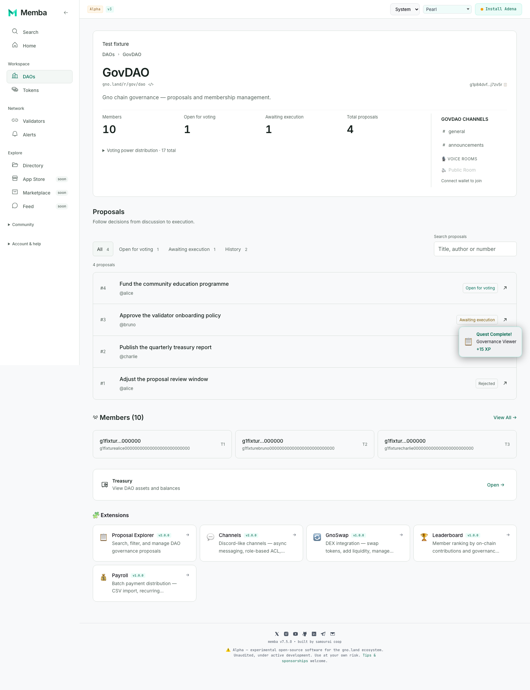
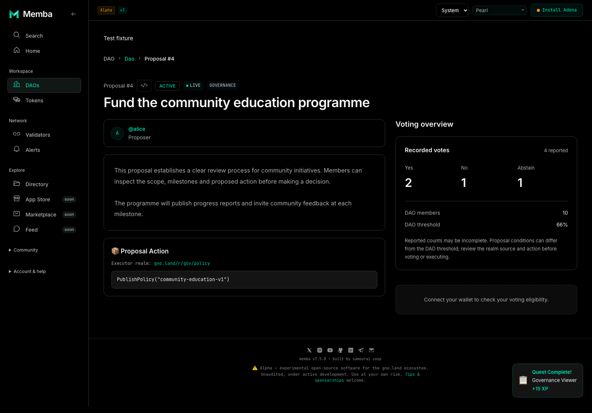
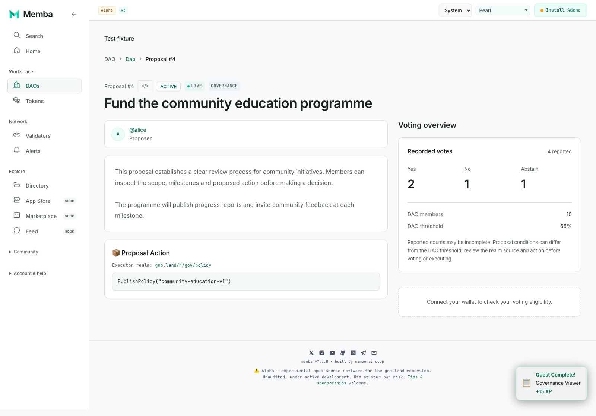

# DAO and proposal design review

The approved Quiet Confidence direction now extends to DAO overviews and proposal readers. This is a default-off working preview, stacked on the Validators, theme and Folded M shell work. It does not activate mainnet packages or change transaction permissions.

[Open the live mainnet DAO preview](http://127.0.0.1:5194/mainnet/dao/gno.land/r/gov/dao) · [Implementation and verification notes](GOVERNANCE-HANDOFF.md) · [Shell and brand review](SHELL-BRAND-REVIEW.md)

## What to review

- A wider workspace, direct summary counts and a compact disclosure for voting power.
- Distinct Open for voting, Awaiting execution and History filters, plus search by title, author or proposal number.
- Whole-row proposal/member links that work with keyboard navigation and preserve network-prefixed destinations.
- A readable proposal column beside recorded votes, DAO context and the existing action controls; a single column on smaller screens.
- System appearance, Light and true Black surfaces. Existing capability and wallet notices remain visible.

## Known mainnet rollout blocker

Live read-only inspection found that GovDAO proposal #4 appears as **Awaiting execution** in the overview but **ACTIVE** in the detail reader. The unchanged reader at pilot head `a3f8559b` reproduces the same ACTIVE state, so this is not introduced by the professional presentation. Its legacy voting summary also substitutes a 60% threshold where the new reader correctly reports the absent configuration as unavailable.

The status mismatch must be resolved in a separately owned read/parser change before mainnet rollout. The existing `getProposalDetail` status parser scans broad text before its explicit Status fallback; investigate that parsing contract against actual realm render output, without changing signing eligibility incidentally. This slice preserves the existing transaction behavior and does not claim the live proposal is actionable. No wallet was connected during comparison.

## Rendered screens

These screenshots use labelled synthetic test data. They demonstrate layout and states, not live network activity or a recommendation to execute the illustrated action.

### DAO overview, Black

### DAO overview, Light

### Proposal reader, Black

### Proposal reader, Light

[Mobile proposal reader](assets/proposal-mobile.png)

## Boundaries and remaining work

Creation, the full member-management screen, treasury, channels and extension routes keep their existing feature presentation. The overview retains entry points to them. DAO directory, onboarding, transaction review dialogs and other feature families remain later slices.

The experimental composite health and non-voter estimates are removed from the primary overview; the existing separately gated analyst feature remains available. The professional list emphasizes proposal status and recorded personal votes; it does not present unverified vote bars or a prediction of whether an on-chain condition passes. Detailed records remain on proposal pages. Personal “needs my vote” filtering is deferred until vote completeness can be represented reliably.

Some read helpers return empty values for both missing data and transport failure. The reader therefore says “unavailable” and offers retry, rather than asserting that the proposal does not exist. An empty vote result is not treated as proof of zero turnout. This slice does not change those underlying parsers.

Automated accessibility checks cover the changed overview, members, proposal list and reader in Light and Black. Real-wallet/device and manual screen-reader review remain release gates. Production rollout requires its own decision after the stacked branches are integrated.
