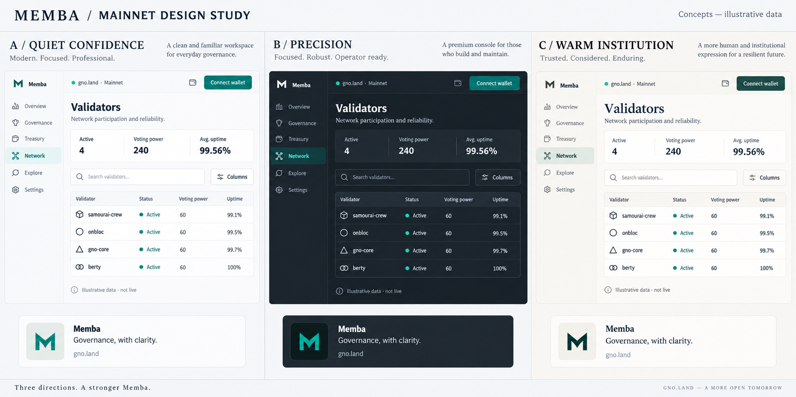
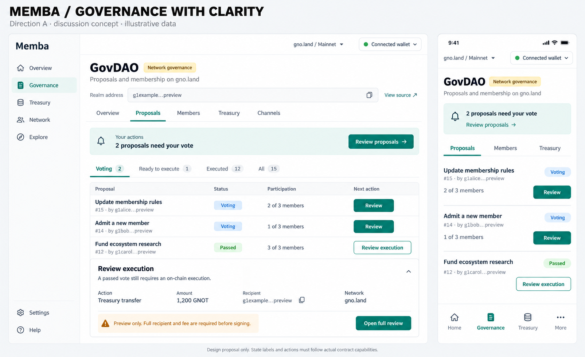

# Art direction and UX proposals

**Historical round-1 proposal.** Direction A, the broad audience, system-default true-black theme, navigation simplification in principle, separate branding exploration and Validators-first proof are now confirmed in [DECISIONS.md](DECISIONS.md). The charcoal/slate B recommendation below is superseded. See [VALIDATORS-PROOF.md](VALIDATORS-PROOF.md) for the current proposal. Detailed behavior and implementation remain unapproved.

## Three directions

| | A · Quiet Confidence | B · Precision | C · Warm Institution |
|---|---|---|---|
| Character | Clear, familiar, focused business workspace | Serious, information-rich operator environment | Calm, human, editorial institutional identity |
| Palette | Cool off-white canvas, white surfaces, slate text, deep teal action | Charcoal canvas, layered slate surfaces, soft white text, restrained teal | Warm ivory canvas, ink text, forest teal and subtle governance gold |
| Typography | Inter throughout; tabular numbers; mono only where useful | Same readable sans-serif system; compact optional density | Sans-serif interface; optional editorial serif for public-facing titles |
| Composition | Task header, compact summary, broad useful content area | Tighter rows and analytical details, deliberate surface contrast | More generous rhythm for narrative and public explanation; operational tables stay efficient |
| Best fit | DAO teams, shared treasuries and mainstream participation | Validators, analysts, sustained operational work | Foundations, organizations and governance communications |
| Main tradeoff | Can look generic if brand details are neglected | Dark-first can preserve the impression of specialist software | Too much editorial styling can slow operational screens |
| Recommendation | Preferred primary direction to validate | Use as dark-theme and advanced-density input | Consider for brand/editorial surfaces if the organization wants a warmer voice |

These should become one coherent system after selection. Mixing three unrelated component systems would reproduce today's fragmentation. Theme and density are separate choices: light can be compact and dark can be comfortable. Density should change spacing and column presentation, not permission or feature availability.

The references are principles to interpret, not products to copy. Qonto's dashboard/account organization supports a task-focused business model; Revolut Business is useful for clear spending workflows; Apple's guidance supports hierarchy, legibility and predictable interaction. These are design inferences from public materials, not an audit of their authenticated products: [Qonto dashboard](https://qonto.com/en/accounting/dashboard), [Revolut expense management](https://www.revolut.com/en-US/business/expense-management/), [Apple Human Interface Guidelines](https://developer.apple.com/design/human-interface-guidelines/).

## Proposed design foundations

Retain the useful existing Inter, JetBrains Mono and Phosphor assets. Explore the current emblem separately; logo replacement is not required to improve the interface. Memba's teal should identify actions and selection. GovDAO can retain restrained gold. Success, warning and danger need separate semantic roles, supported by text and icons.

Initial values below are design hypotheses, not code-ready tokens or contrast-certified combinations:

| Foundation | Proposal |
|---|---|
| Light palette | Canvas `#F5F6F8`, surface `#FFFFFF`, primary text `#18252F`, action teal around `#087F70` |
| Dark palette | Canvas around `#14191F`, surface around `#20272F`, high-contrast soft-white text; independently tuned action/state colors |
| Body and controls | 15–16 px body, 14–15 px controls; 1.45–1.6 line height for prose |
| Data and metadata | 13–14 px tables; 12–13 px secondary labels; tabular figures and consistent decimals |
| Titles | Approximately 28–32 px page heading, 18–22 px section heading; mobile adjusts by hierarchy, not global shrinkage |
| Space | Reconcile existing 4 px scale; 24–32 px desktop content gutters and 16–20 px mobile gutters |
| Surfaces | Subtle dividers and a small radius scale; use cards for grouping, not around every datum |
| Controls | Clear primary/secondary/quiet/destructive hierarchy; visible hover, focus, pending and disabled reason |
| Motion | Short functional transitions; stable table positions during refresh; respect reduced motion |
| Icons | One consistent line-icon vocabulary in product chrome; emoji remain appropriate in user/community content |

The system needs documented components and behaviors, not only colors. Define button, field, validation message, tabs, table, status, address, amount, empty state, loading state, error state, dialog, drawer, toast, pagination and transaction review contracts. Give each component light/dark, keyboard, loading, error and mobile examples. Reconcile legacy token aliases gradually instead of globally replacing names or literals.

## Layout families

| Page type | Space allocation |
|---|---|
| Operational workspace | Fluid available width, starting 24–32 px after navigation; validators, assets, members, activity, reports and moderation. On very wide monitors evaluate an optional cap around 1,680–1,920 px. |
| Object detail | Approximately 1,200–1,440 px workspace; narrative and activity in main column, contextual details in a secondary column when useful. |
| Reading | Narrative measure roughly 60–75 characters; surrounding metadata can use available space. Blog, reports, proposal explanation and feed. |
| Form | Approximately 640–760 px primary form; optional review/help column on wide screens; single column on mobile. |
| Conversation / specialist canvas | Purpose-specific full workspace for channels, telemetry or games, with consistent app context and escape route. |

At 1,920 px, a 224 px sidebar and two 32 px gutters would leave approximately 1,632 px for the main workspace. At 1,440 px they leave 1,152 px. This is a useful layout starting point, not a promise to fit fourteen columns everywhere. Prioritize useful columns, preserve access to all others, and allow contained scrolling for an explicitly selected wide expert view.

## Validators: concrete redesign

The default view should answer “Who is participating, how much influence do they have, and is anything wrong?”

1. Header: Validators, visible network, compact freshness/source information, advanced telemetry entry.
2. One summary strip: active validators, voting power, block height, average block time. Peer count belongs naturally with the Network tab. Health exceptions can be a compact inline notice.
3. Toolbar: search, health filter, column chooser and density control. Saved presets are a proposal requiring separate scope approval.
4. Default table: validator identity, consensus/health status, voting power with share, participation, uptime, recent activity. Pick the final columns with actual operator tasks.
5. Row detail: full addresses, profile/source, metric definitions and time windows, missed blocks, transaction contribution, last downtime, reviews and historical data.

Pin identity when the optional wider table scrolls. Right-align numbers. Never reorder rows underneath a pointer during polling. Explain empty or unavailable metrics with an em dash and reason, not zero. Keep search/filter/sort behavior stable on back navigation. On mobile use a concise list with identity, status, power and uptime; open detail for the rest. Operators still need access to every metric.

The board intentionally shows fewer columns for comparing visual directions; it is not the final table specification or permission to drop functionality.

## DAO governance: concrete redesign

Use a stable DAO identity header and tabs for Overview, Proposals, Members, Treasury and Channels where the DAO supports them. A general DAO and native GovDAO need capability-aware variations.

For a member, lead with “Your actions”: proposals awaiting their vote, signatures awaiting them, or execution work they can perform. For a visitor, lead with the DAO purpose and currently open decisions. Do not imply a visitor has a role or permission.

Replace the long equal-weight stack with filterable proposal rows: title, author, lifecycle, participation and next action. Separate voting from ready-to-execute and executed history. Show passing thresholds separately from headcount participation; never imply one equals the other. Keep narrative reading width bounded in the detail view.

Move power distribution, tier explanations, scores and channels out of the crowded summary header. Those remain accessible and useful, but do not need to occupy the first mobile viewport.

The proposal lifecycle must be validated against each supported DAO adapter. “Passed” may not establish that an action remains executable; unknown status must remain unknown. Treasury tabs and example spending proposals appear only where those capabilities actually exist.

## Treasury and transaction clarity

Give a team a clear account/DAO context, asset ledger, pending approvals and transaction history. Separate holdings from amounts awaiting an action. Display GNOT and GRC20 quantities consistently, with raw units inspectable; do not invent conversion prices.

Preserve existing transaction and deployment guardrails. Standardize their presentation around:

- Intent: what the user is authorizing in ordinary language.
- Actor and authority: which wallet, DAO or signer is acting; relevant threshold.
- Network and target: selected chain, exact contract or full recipient.
- Effects: asset, exact amount, permissions changed, messages and fees where known.
- Evidence: underlying payload and simulation only if actually supported; uncertainty explicit.
- Lifecycle: review → wallet signature → submitted → chain-confirmed, with proposal/approval stages where applicable.

Wallet approval is not chain confirmation. A rejected signature should preserve safe form input. An uncertain broadcast outcome must offer a status check rather than encouraging a duplicate transfer. “Retry” must describe what it will retry.

## Proposed information architecture

This is an option to test with users, not a commitment to rename routes. Keep current URLs working.

| Main destination | Contents |
|---|---|
| Overview | Visitor introduction or member's pending work and recent activity |
| Governance | DAOs, proposals, membership, DAO conversations and relevant organization work |
| Treasury | Shared wallets, balances, tokens, transactions, payroll where supported |
| Network | Validators, candidates, node roster and advanced telemetry |
| Explore | Directory, apps, marketplace, feed, Gnolove, quests, games, community leaderboards and editorial content |
| Account / utilities | Profile, settings, alerts configuration, extensions, help/feedback and release information |

Treasury as an umbrella for individual tokens may prove confusing; test “Wallets & assets” as an alternative. Explore must have visible subnavigation and search, not become a miscellaneous drawer. Feed may deserve a top-level position if community engagement is a primary objective. This audience decision should precede navigation implementation.

On mobile, target four or five clear destinations with contextual access to the rest. Avoid changing meaning when “Alerts” becomes “Activity” unless the destination actually supports that promise.

## Capability and system-state language

Use concise state messages that explain consequence and recovery. Example drafts:

| Situation | Proposed message |
|---|---|
| Native network reads available, Memba collaboration unavailable | “Network data is available. Memba channels are not deployed on this network yet.” |
| Wallet mismatch | “Your wallet is on Pearl. This page is on gno.land.” Action: Review network switch. |
| Stale data | “Last updated at 14:32. We couldn't refresh this data.” Action: Retry refresh. |
| No proposals | “No proposals yet.” An eligible member can create one; a visitor can learn how governance works. |
| Vote passed but execution outstanding | “Voting passed. Execution is still required.” Only show an execution action when supported and permitted. |
| Signature declined | “Signature cancelled. Your transaction was not submitted.” Use this only when submission is known not to have occurred. |
| Result uncertain | “Submission status is not confirmed yet.” Action: Check transaction status. |

Professional presentation must not imply audits, insurance, custody guarantees, regulatory approval or institutional certification that Memba does not have. Mainnet availability and production assurance are separate facts.

## Sharing and brand assets

The current square image has recognizable identity, but its dark emblem, small subtitle and technical grid background are weak at thumbnail size. Prepare a landscape family with a proposed 1,200 × 630 px master, substantial safe margins, a short title and a consistent Memba identifier. This dimension is a working design choice, not an Open Graph requirement.

Templates: general Memba; DAO; proposal; validator; collection/item/app; blog/article; public feed post. Each should carry the public object's name and network when relevant. Use a smaller set of templates with reliable fallbacks rather than ad hoc artwork on every route. At small size, title and identity should still be legible. Keep private balances, pending signatures, webhook destinations and nonpublic activity out of shared assets.

Artwork and delivery are separate acceptance items. A crawler should receive correct title, description, absolute image URL, image dimensions/type/alt, canonical URL and network context without depending on client-side navigation. Preserve hidden/deleted post suppression, escape user text, bound title length, and use safe branded fallbacks on timeout. The current feed edge handler is a partial foundation. See [Open Graph protocol](https://ogp.me/) for metadata semantics.

Validate direct public URLs and network-prefixed variants with real crawler HTML, image status/content type, redirects and social preview tools. Consider external preview caches when changing assets. Merely changing React metadata or replacing the JPEG does not establish that shared links render correctly.

## Concept-board limitations

The boards were generated as raster art-direction studies using the built-in image tool; prompts are retained in [PROMPTS.md](PROMPTS.md). They are not accessibility measurements, editable design components or pixel specifications.

- Board 1 introduces an unapproved placeholder M monogram; the current emblem is still the baseline. Its B/C headings include serif styling that is not proposed for routine operational UI.
- Board 2 highlights the Voting filter while also showing a passed row. A final design must either select All or show only voting rows. This illustration must not become the behavioral specification.
- Addresses, transactions, numbers and connection states are illustrative. The abbreviated recipient is permissible only in the pictured overview; final signing review must expose the exact full recipient and actual fee/network data.
- The GovDAO treasury example is an example of visual structure, not an assertion that native GovDAO supports that spending flow. Use a capable fixture DAO for implementation validation.
- The diagrams simplify feature navigation. The audit inventory is the coverage source of truth; no feature is removed by omission from an image.

## What to validate with people

Use the same tasks and content across directions: find a validator's health issue; distinguish a passed vote from an executed proposal; identify the network and signer before approving a spend; find a previously used feature after navigation changes. Include a treasury operator, a governance participant, a validator operator and a newcomer.

Proposed acceptance hypotheses: the default validator columns need no horizontal scrolling at 1,440/1,920 px; the primary mobile DAO task appears in the first viewport at 390 px; participants correctly explain the effect and network before confirmation; no capability becomes unreachable. These are future targets, not measured improvements.
