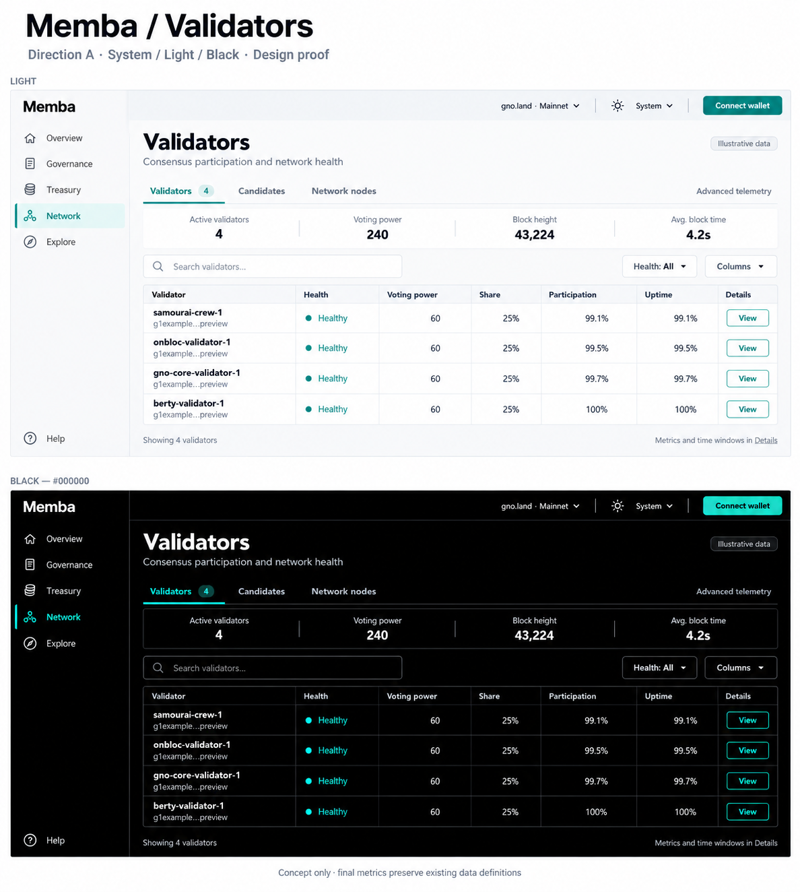

# Memba: professional mainnet design study

**14 September 2026 · Working pilot · Isolated implementation authorized; production rollout pending**

Memba has substantial functionality, but its presentation still asks users to interpret a developer-oriented ecosystem dashboard. The strongest opportunity is to make everyday governance and treasury work immediately understandable, while preserving technical depth and truthful network status.

**Confirmed direction:** A, Quiet Confidence, for DAO/treasury teams, mainstream communities and entrepreneurs/companies building on gno.land. Follow the system theme by default, with true `#000000` Black instead of B's charcoal/slate palette. Simplified navigation is accepted in principle. Validators is the first design proof. **01 / Folded M** is selected for separate branding refinement.

## Latest review

**Mainnet status correction:** [draft PR #1199](https://github.com/samouraiworld/memba/pull/1199) fixes the proposal status mismatch and the incorrect “awaiting execution” interpretation of GovDAO ACCEPTED. See the [evidence and review limits](MAINNET-STATUS-BLOCKER.md). This is a separate main-based fix; the design previews below remain unchanged pending integration.

The **DAO overview and proposal reader** stage is now ready in [draft PR #1197](https://github.com/samouraiworld/memba/pull/1197). Start with its [review pack](https://github.com/samouraiworld/memba/blob/feat/professional-governance/docs/design/professional-mainnet-2026-09/GOVERNANCE-REVIEW.md) or [live mainnet preview](http://127.0.0.1:5194/mainnet/dao/gno.land/r/gov/dao). It includes Black/Light/mobile screens, verification and an explicit pre-existing list/detail status mismatch that blocks mainnet rollout. Transactions and feature capability gates are preserved.

The subsequent **shell and Folded M package** is ready in [draft PR #1196](https://github.com/samouraiworld/memba/pull/1196). Start with its [review pack](https://github.com/samouraiworld/memba/blob/feat/professional-shell-brand/docs/design/professional-mainnet-2026-09/SHELL-BRAND-REVIEW.md), [live navigation preview](http://127.0.0.1:5191/mainnet/validators), or [actual-size brand specimen](http://127.0.0.1:5191/brand/folded-m/specimen.html). It adds a separate default-off shell flag and preserves the staged feature-body roadmap. Production rollout is pending.

## Working pilot

**Start with [the consolidated final review](REVIEW.md).** The authorized pilot has been completed for review, including autonomous interaction decisions and expanded state/browser validation. Theme foundation: [draft PR #1194](https://github.com/samouraiworld/memba/pull/1194). The [Validators pilot in draft PR #1195](https://github.com/samouraiworld/memba/pull/1195) runs behind a default-off flag on a separate branch. [Task ledger and handoff](TASK-LEDGER.md) records scope, ownership and validation.

These are **rendered application screenshots using synthetic test fixtures**, labelled in each frame; they are not live mainnet telemetry.

[Mobile Black screenshot](assets/pilot-black-mobile.png)

## Art-direction record

1. [Confirmed decisions and remaining choices](DECISIONS.md)
2. [Validators: Light and true Black proof](VALIDATORS-PROOF.md)
3. [Separate M branding exploration](BRANDING.md)
4. [Implementation-plan proposal](IMPLEMENTATION-PLAN.md)

## Initial audit and historical proposals

1. [Audit: findings and coverage of every feature family](AUDIT.md)
2. [Three art directions and concrete UX proposals](PROPOSALS.md)
3. [Safe collaboration proposal and decision gates](WORKING-AGREEMENT.md)
4. [Route and page inventory](INVENTORY.md)

These are generated discussion sketches with illustrative data. They are not implemented screens or final specifications. The monogram in the first board is a placeholder, not a proposed approved logo. See the limitations in PROPOSALS.md before using either board for development.

## Scope and evidence

Only the Memba repository is in scope. This branch adds design documentation and concept images; it changes no application code, configuration, dependencies, contracts, or deployment settings.

The study combines three user screenshots, a source-based heuristic review at `e20d261b`, and limited public, disconnected browser inspection. It inventories all routed feature families, including gated features and plugins. It does **not** certify every authenticated flow, every deployment, accessibility conformance, or contract security. Coverage depth and remaining validation are explicit in the audit.

The shared `/Memba` checkout was on `main` at `4a7081ec`, clean and two commits behind its local `origin/main` reference. The isolated worktree was created from that reference at `e20d261b` on `docs/professional-design-audit`. This records the exact audit snapshot rather than claiming it was the latest deployed version.

## Decisions for the next review

- Approve or refine the Validators layout, default/optional columns and responsive/state behavior.
- Review the working pilot and its provisional columns/mobile disclosure before broader adoption.
- Refine the selected Folded M into consistent vector, monochrome and small-size assets.

The original A/B/C and governance boards remain below as historical exploration. Their charcoal/blue dark palette and unresolved audience questions are superseded by DECISIONS.md. The detailed navigation labels, final production asset specifications and production release remain unapproved; the Folded M direction itself is selected.
