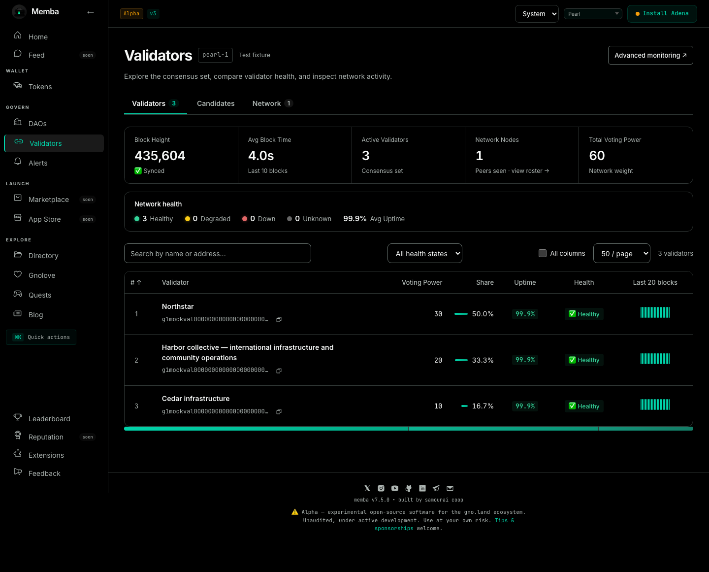
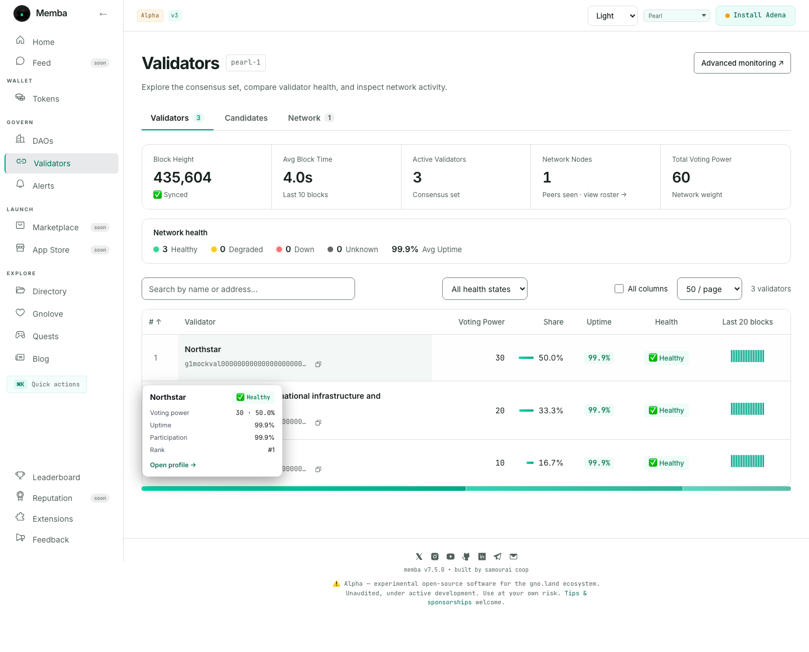
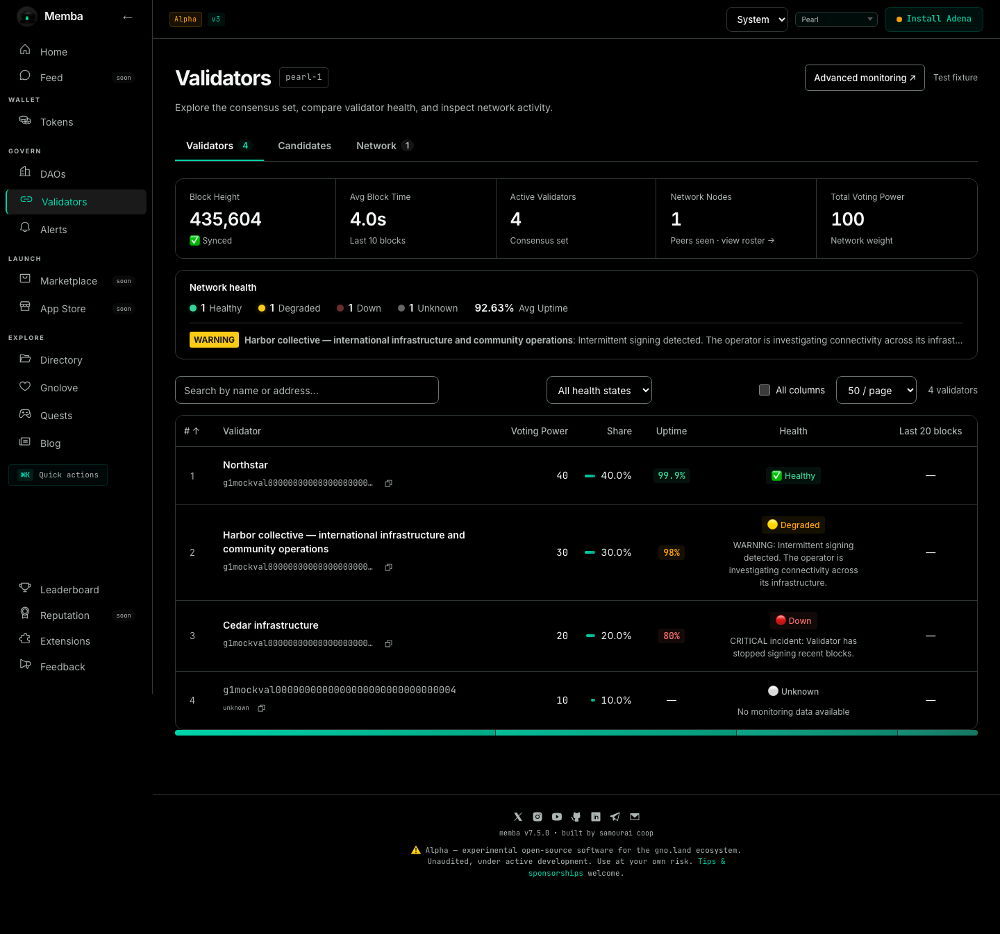

# Memba professional UI — final Validators pilot review

**14 September 2026 · Direction A · System / Light / true Black · Memba only**

The authorized Validators pilot is ready for visual review. The desktop workspace now uses the available width, the primary comparison table is readable, and mobile places the roster ahead of an expandable network summary. Health and unavailable-data states remain explicit. The implementation is isolated and off by default in production.

**Subsequent stage:** the [shell and Folded M review](https://github.com/samouraiworld/memba/blob/feat/professional-shell-brand/docs/design/professional-mainnet-2026-09/SHELL-BRAND-REVIEW.md) is now available in [draft PR #1196](https://github.com/samouraiworld/memba/pull/1196), with its own default-off flag. The evidence below records the preceding Validators-only pilot.

## Review in this order

1. Compare **Black and Light** below. Assess hierarchy, density and the balance of comparison versus technical detail.
2. Look at the **mobile** and **mixed-health** screens. Search, health and sort controls remain reachable; long names and health explanations wrap.
3. Open the [local live preview](http://127.0.0.1:5188/mainnet/validators) while its server is running. It reads real configured network data. Use All columns, health filtering, theme selection and the existing section tabs. The [handoff](https://github.com/samouraiworld/memba/blob/feat/validators-professional-pilot/docs/design/professional-mainnet-2026-09/PILOT-HANDOFF.md) contains reproducible startup commands.

**All screenshots below are rendered application screens with synthetic test fixtures**, not mainnet telemetry. Each frame is labelled. The live preview may show raw addresses and unavailable monitoring metrics when no custom monitoring environment is configured; this is expected and is not replaced by fixture values.

## Desktop — Black

## Desktop — Light

## Mixed health and long content

[View the same mixed states in Light](assets/pilot-mixed-light.png).

## Mobile and tablet

[Open the iPhone/WebKit screen at 390 CSS px](assets/pilot-black-mobile.png) · [Open the 1024px tablet screen](assets/pilot-black-tablet.png).

On phones, Network overview starts collapsed; all its information remains available. The roster uses cards, 25 items per page, and 16px native controls. At intermediate tablet widths, the table may scroll inside its labelled comparison region with validator identity pinned. At tested desktop widths 1280/1440/1920px, default columns fit without horizontal table scrolling.

## Decisions made during autonomous completion

| Decision | Reason |
|---|---|
| Seven primary columns, six when uptime is absent | Prioritize identity, voting power, share, uptime, health and recent signatures. Keep the rank reference. |
| Grouped All columns | Preserve expert data without adding a preference editor to the first pilot. |
| Explicit health filter, including Unknown | Support operational triage without treating unavailable information as healthy or zero. |
| Visible non-healthy reasons | Make the status understandable without hovering. |
| Collapsed mobile summary | Bring comparison controls and the first validator into view sooner. |
| Ephemeral column/filter settings | Keep the first implementation reversible and avoid inventing a persistence contract. |

Per-column preference editing, saved presets and density settings are deliberately deferred. These are final-review defaults, not requests for intermediate decisions.

## Validation and review limits

- **The full frontend unit suite, production build and lint passed on the final branch in CI.** The earlier local full run passed 5,017 tests with one existing skip; the post-refresh duplicate local unit rerun was stopped after equivalent CI verification. Final local build/lint also passed.
- **36 preview browser cases passed** across Chromium, Firefox, iPhone/WebKit and Pixel. Widths: 320, 390, 768, 769, 1024, 1280, 1440 and 1920 CSS px.
- Healthy, mixed-health and resolved-incident axe scans passed in Light and Black for the changed main content. Keyboard checks cover controls, native disclosure, tab arrows and horizontal table scrolling with sticky identity. Status/incident labels are 12px and pagination text is 13px, including legacy child-style overrides.
- Tests cover a 73-validator roster, pagination, filter resets, absent monitoring/signatures, unknown values, loading, initial error/retry and retained data after a failed refresh.
- The theme foundation's mobile guardrails passed; its desktop CI found one ambiguous test selector, now corrected to name the network picker. The affected three desktop tests pass locally, and the corrected theme branch is green in CI for Node 20/22, full Chromium E2E and mobile guardrails.
- Compared with the refreshed theme foundation, Validators CSS grows from 4.35 to 6.20 kB gzip, route JS from 9.41 to 10.33 kB, and main JS from 119.42 to 119.54 kB. These are build sizes, not load-time benchmarks.
- Read-only mainnet inspection confirms the updated health filter and accurate missing-monitoring message. No transactions were performed.

Remote evidence: [theme foundation checks](https://github.com/samouraiworld/memba/pull/1194/checks) · [dedicated four-browser preview workflow](https://github.com/samouraiworld/memba/actions/runs/34891835958).

This is not an accessibility certification. Manual screen-reader, physical-device, actual browser-zoom and connected-wallet reviews remain required before rollout. Candidates/Network preserve integration and tab navigation; their full visual/state redesign is not claimed here. The larger fixture verifies behavior, not a rendering-performance benchmark.

## Change isolation

| Review unit | Branch / head at handoff | Review |
|---|---|---|
| Theme behavior | `feat/system-theme-preference` · `d3028e88` | [Draft #1194](https://github.com/samouraiworld/memba/pull/1194) |
| Validators pilot, stacked on theme | `feat/validators-professional-pilot` · `a3f8559b` | [Draft #1195](https://github.com/samouraiworld/memba/pull/1195) |
| Design record and this pack | `docs/professional-design-audit` | [Draft #1186](https://github.com/samouraiworld/memba/pull/1186) |

Both branches incorporate mainline `d49896a1`, including the validator page-size accessibility fix and protobuf update. The duplicate label caused by the overlap was removed. The shared Memba checkout and other sessions' worktrees were not edited. No contract, authentication, transaction, data-fetching or health-calculation changes are included. Disable/omit `VITE_ENABLE_PRO_UI` to retain the existing presentation; theme behavior is separately reversible. No merge or production activation has been performed.

## What follows this review

The next boundary is approval or revision of this pilot's visual treatment and defaults. Then apply the approved foundations to the exact navigation proposal and bounded feature-family waves in the [implementation plan](IMPLEMENTATION-PLAN.md). Do not expand global styles across unfinished features in one refactor.

The branding direction remains **01 / Folded M**. Its production vector/monochrome/icon/share-image refinement is separate, as requested; the preview still uses the current emblem. The [branding brief](BRANDING.md) retains the selected geometry and actual-size acceptance requirements.

The original [all-feature audit](AUDIT.md), [inventory](INVENTORY.md), [decisions](DECISIONS.md) and [task ledger](TASK-LEDGER.md) remain the continuity record for future sessions.
