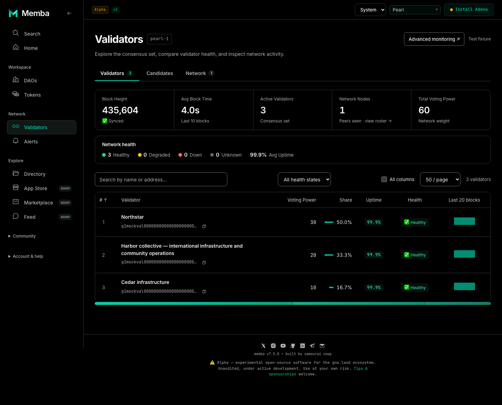
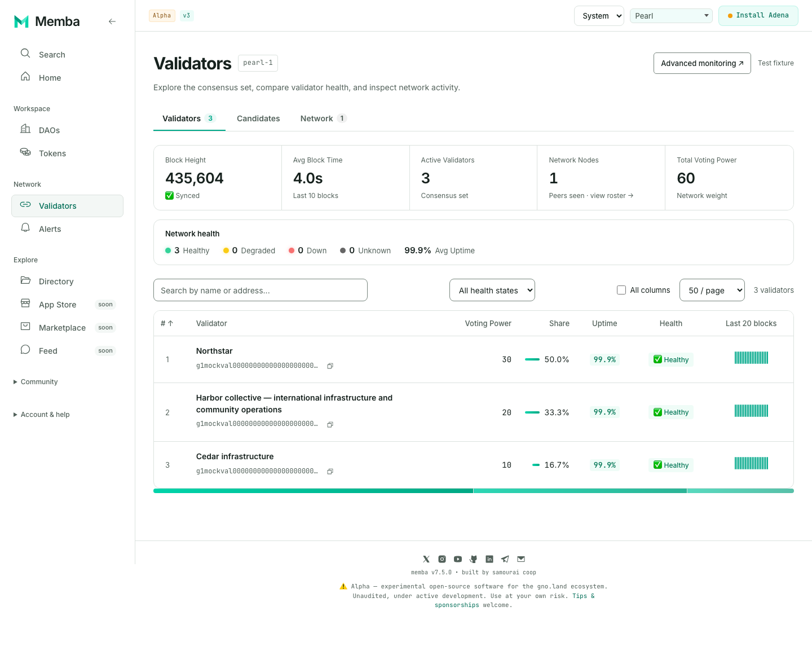
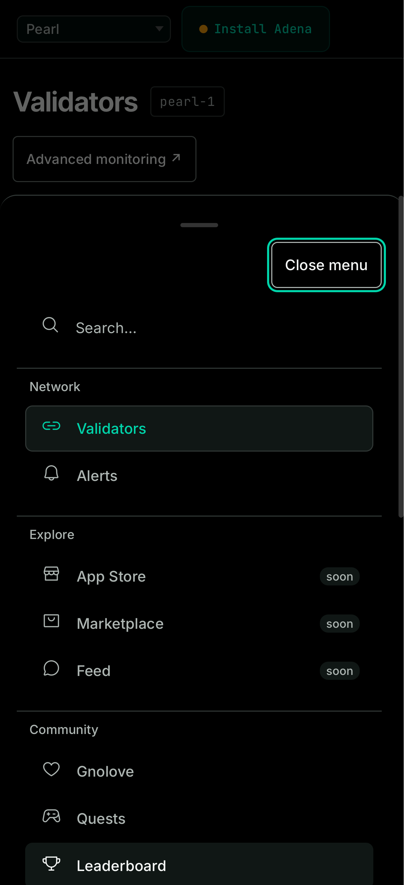
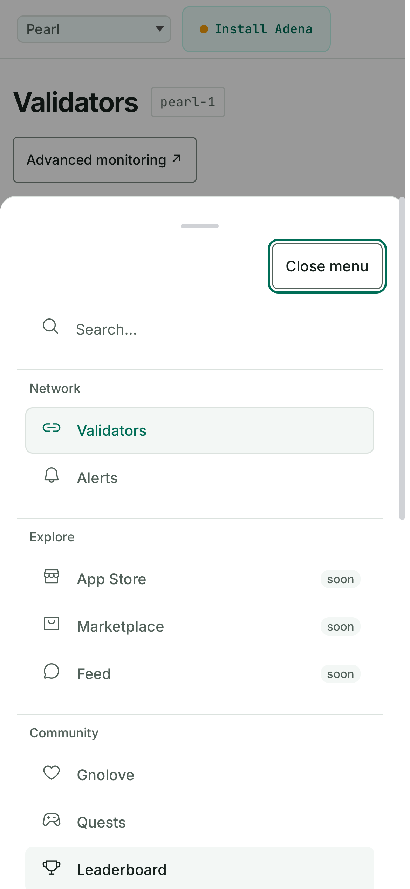
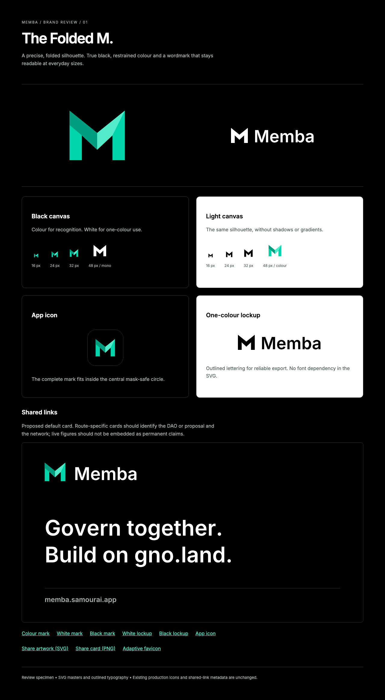

# Shell and Folded M review

**Ready for design review:** the selected Folded M identity, a working professional navigation shell, and an exportable sharing-card proposal. The existing Validators pilot remains the first migrated feature body.

Start with the [live shell preview](http://127.0.0.1:5191/mainnet/validators) and [brand specimen](http://127.0.0.1:5191/brand/folded-m/specimen.html). The live app reads the configured network; the screenshots below use clearly identified synthetic validator fixtures. Its local build-time availability flags can differ from the deployed application.

## What changed

- Desktop: 240 px navigation with Workspace, Network and Explore sections. Community and Account & help expand when needed. The sidebar collapses to 76 px.
- Mobile: Home, DAOs, Tokens, Directory and More. The menu preserves eligible destinations, uses readable native controls, and supports Close, Escape, keyboard focus wrapping and iPhone focus return.
- Identity: controlled Folded M vectors in colour/black/white, outlined wordmarks, adaptive favicon, app icons and a 1200 × 630 sharing card.
- Themes: System follows the device preference; Black uses a real `#000000` canvas. Existing saved Light/Black preferences remain respected.

### Black desktop

### Light desktop

### Mobile menu

### Folded M and sharing artwork

Download the masters and PNG renditions from [the asset directory](../../../frontend/public/brand/folded-m/) or use the browser specimen. The wordmarks contain outlined paths and need no installed font. The sharing copy is a proposal, not a claim that every capability is live on mainnet.

## Observed validation

- Lint and TypeScript/production build passed.
- **19 targeted tests passed**: complete navigation mapping, visitor/member/admin gates, addressed profiles, notifications, legacy navigation and sheet behavior.
- **35 browser checks passed** in the initial complete shell lane, followed by **8 focused desktop checks** that explicitly verify default table columns fit at 1280/1440/1920 px with the wider sidebar. The final CI lane contains 37 cases: Chromium, Firefox, iPhone WebKit and Pixel emulation. Includes 320–1920 px layouts, Black/Light, keyboard navigation/search, mobile focus containment/return, route scope, asset rendering and scoped axe checks.
- Six PNG assets were exported through Chromium from the SVG masters; dimensions checked, including the 1200 × 630 card and 16/32 px favicon renditions. Firefox verifies SVG rendering in the specimen; transparent PNG export uses Chromium because this Firefox screenshot operation is unsupported.
- Full frontend regression and the original Validators browser lane also run in the pull request's Professional preview workflow. The final CI result is linked from [draft PR #1196](https://github.com/samouraiworld/memba/pull/1196).

The expanded shell is separately default-off (`VITE_ENABLE_PRO_SHELL=true`). The Validators body remains separately default-off (`VITE_ENABLE_PRO_UI=true`). Existing production icons, PWA identity, shared-link metadata, contracts and transaction behavior are unchanged. No production merge or deployment has been performed. The repository may generate a default-flags deploy preview automatically for the draft PR.

## Remaining decisions and follow-through

The hierarchy, artwork and mobile bar are now concrete enough to review together. Production activation still needs the usual manual screen-reader, real zoom, physical-device and connected-wallet checks. The app's existing deployment/readiness notices remain visible.

The next feature-body slice is DAO overview and proposal reading/voting presentation. Treasury capability and transaction work must remain with its existing owners. Home, tokens, directory, marketplace, community, account and advanced-monitoring bodies remain on the staged audit roadmap; this review does not claim their redesign is complete.

See [the implementation handoff](SHELL-BRAND-HANDOFF.md) for the route mapping, asset geometry, tokens, flags, ownership boundaries and rollback procedure.
