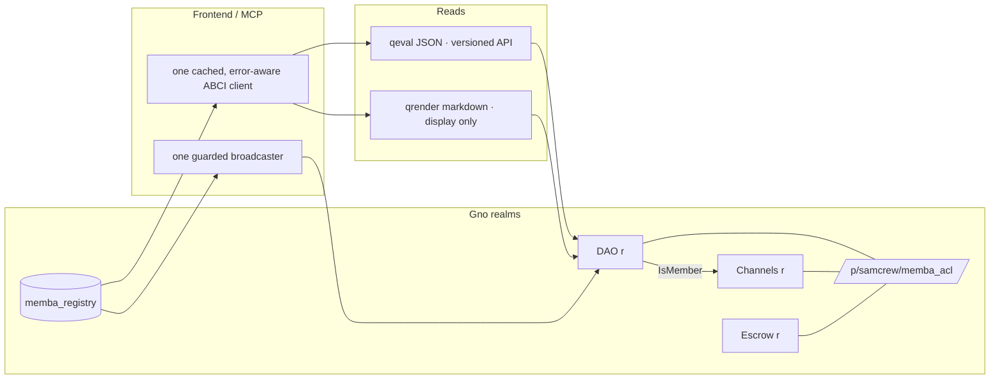

# Memba — Cross-Perspective Audit & AAA Implementation Plan

> **Document type:** Deep technical audit + CTO-level remediation & delivery plan
> **Date:** 2026-06-30
> **Revision:** **Round 2** — extended with a deeper cross-perspective review (3 Gno.land-expert CTO lenses + UX/product/accessibility + performance/DX/test/observability). See §10 for the round-2 findings register and §5 for the revised waves.
> **Scope:** Full repository (`frontend/`, `backend/`, `contracts/` + generated Gno realms, `api/`, `mcp-server*/`, `packages/`, infra/CI, docs) and its first-party dependencies.
> **Method:**
> - **Round 1** — four parallel domain audits (frontend, backend, Gno/codegen, infra/CI) + direct source verification of every HIGH/P0 finding.
> - **Round 2** — five additional expert passes with distinct lenses: *Gno CTO-A* (on-chain realm design, upgradeability, gas/determinism, std API), *Gno CTO-B* (codegen-as-compiler, deploy/versioning/provenance), *Gno CTO-C* (frontend↔chain integration correctness), *UX/Product/A11y engineer*, *Performance/DX/Test/Observability engineer*. Every elevated P0/P1 was re-verified at source.
> **Status of code:** Alpha, self-declared *experimental and unaudited* (see `DISCLAIMER.md`). This document is an internal engineering audit, **not** a substitute for a formal third-party security audit.

---

## 0. How to read this document

This is structured so each reader can enter at the right altitude:

1. **§1 — The picture.** Executive summary; **§1.1** is the round-2 delta (read this first if you read the round-1 version already). **§2–§3** = Gno mental model + threat model.
2. **§4 — Round-1 findings register**, and **§10 — Round-2 findings register** (new/deeper, five expert lenses). Every issue is severity-rated with `file:line` evidence. This is the audit.
3. **§5–§9 — The plan** (waves W0–W6, dependency-ordered, with acceptance criteria and quality gates), **§11 — the target architecture**, and **§12 — the ready-to-proceed kickoff** (PR-sized units in execution order). This is the CTO deliverable.

**On effort estimates:** per house style, this plan deliberately does **not** estimate calendar time. Difficulty is expressed in terms of *blast radius* (which subsystems change), *invasiveness* (how deep the edit goes), and *risk/dependencies* (what must land first, what can go wrong).

---

## 1. Executive summary

Memba is an unusually ambitious alpha: a single product that fuses a **multisig coordination service**, an **on-chain DAO governance hub**, a **token + NFT launchpad/marketplace**, a **validator telemetry suite**, an **AI governance analyst**, and a **gamified onboarding system** — across two Gno networks, with React 19 / Go 1.25 / SQLite / ConnectRPC and a pair of MCP servers for AI agents.

**The headline:** the engineering *maturity signals* are genuinely strong for an alpha — fail-closed auth defaults, a 27-vector DOMPurify regression suite, parameterized SQL throughout, SSRF hardening on IPFS/NFT proxies, GitHub OAuth CSRF protection, a 600 KB bundle budget gate, Buf breaking-change checks, dependency review, and an extensive planning/runbook corpus. This is not a toy.

**But the surface area has outrun the controls in four concentrated places**, and these are where real loss can occur:

1. **On-chain fund-handling correctness** — the committed `memba_nft_offers_v1` realm settles offers by *deleting the order and emitting an event without transferring the NFT or paying anyone* (escrowed buyer funds can be stranded), and the generated escrow code ships without the refund/timeout functions that the frontend already builds calls for. These are **fund-loss class** defects. (Mitigant: the offers realm is gated off the frontend allowlist today; the danger is latent-on-deploy.)
2. **Backend access control & integrity** — `MultisigInfo` returns any multisig's pubkey set and member list to *any authenticated user* (broken object-level authorization); multisig signature verification is shipped in **log-only mode** in production (`fly.toml` deliberately holds enforcement off); `CompleteTransaction` trusts a client-supplied final hash; and quest XP for `off_chain` quests is auto-granted (leaderboard farming).
3. **DAO governance math** — the generated DAO realm finalizes proposals *instantly on a single qualifying vote* (no voting-period floor), uses an asymmetric reject threshold, and `executeAddMember` bypasses the role allowlist that every other path enforces.
4. **Supply chain & SAST labeling** — deploy workflows install release-critical tooling at `@latest` (and pin Fly's action to `@master`), and the README "Security" badge points at a **gosec-only** job — there is no CodeQL/JS SAST despite the implied coverage.

None of these are exotic. All are fixable with surgical, well-scoped changes. The plan in §5 sequences them so that **fund-loss and auth defects land first, behind tests**, before any further feature expansion.

**Top-line verdict (CTO lens):** *Do not widen the product surface until Wave 0 + Wave 1 close.* The codebase has the test infrastructure and discipline to absorb these fixes cleanly; the risk is not capability, it's prioritization. Freeze net-new feature realms, harden the money paths, flip the enforcement flags that are already wired, and make the CI security story match its badge.

### 1.1 What Round 2 added (and changed)

The second, deeper pass (five expert lenses, §10) did three things: it **found two more fund-loss/code-injection class defects**, it revealed the **systemic root causes** behind round 1's symptoms, and it surfaced an entire **product/quality dimension** that round 1 did not cover.

**New P0/P1 defects (verified at source):**
- **Escrow double-refund (P0, fund loss).** `ResolveDispute` refunds the client and sets the milestone to `MsPending` but **never clears `FundedAt`**; `CancelContract` then refunds the *same* milestone again → realm insolvency / double payout (`escrowTemplate.ts:391-403,440-451`).
- **Agent-registry comment injection (P1, code injection).** Raw `config.name` is interpolated into a `//` comment in generated Gno (`agentTemplate.ts:56`), bypassing `escapeGnoString` — a newline closes the comment and injects executable Go (multiple `init()` are legal).
- **Unwired numeric clamps (P1).** `clampInt`/`isValidPercentage` exist in the sanitizer but **no generator uses them**; `threshold`/`quorum`/power are interpolated raw (`daoTemplate.ts:238-239`). `threshold=0` ⇒ every proposal passes on the first YES; `NaN`/huge/negative ints produce broken or overflowing Gno.
- **Board/channel membership is broken or desynced (P0-on-deploy).** Generated board calls `parent.IsMember()` which the generated DAO never exports (won't compile/links nothing); generated channels keep a *separate* local member tree seeded only with the deployer, so DAO members can't post until manually re-added. The CreateDAO wizard ships `_board` while the plugin modal ships `_channels` — **two incompatible companion models**.
- **DAO Render pagination mismatch (P0-correctness).** Generated DAOs emit `page:N` with plain-text footers; the frontend parser looks for `?page=N` clickable links — so any user DAO with >20 proposals shows **only page 1**.
- **Wallet chain-id guard bypass.** On Adena `changedNetwork`, the broadcast guard's `_walletChainId` is not re-synced (`useAdena.ts:391-397`) → after an in-wallet network switch the chain-mismatch block silently disables.

**Systemic root causes (the "why"):**
1. **`Render()` is an unversioned ABI.** The frontend scrapes attacker-influenceable markdown with regexes; a malicious DAO description can forge members/proposals/threshold the UI then trusts. The fix is a **versioned `qeval` JSON read path** (the GRC721 code already does this correctly — standardize on it).
2. **Three Gno std API dialects coexist** (`std.*` legacy, `chain/runtime/unsafe` interrealm-v2, mixed caller identity), and **codegen ↔ deployed ↔ CI-stub** are three different sources of truth that no automated check reconciles.
3. **No upgrade/migration/registry layer.** Immutable realms + hardcoded paths in three files + a `realm-versions.json` the app never reads ⇒ every redeploy strands state and needs hand edits.
4. **Uncoordinated client polling.** 8+ independent timers (down to 2s) hammer public RPC with duplicated work and no shared cache, despite an unused `packages/gno-rpc` cache layer.

**The product dimension:** Memba reads as *three apps stitched together* (multisig wallet · DAO ops · Gno ecosystem portal). For a new user the mental model is unclear; for a fund-moving user **safety is uneven** — DAO contract votes go through a confirmation gate, but **multisig propose/sign/broadcast do not**. Accessibility is explicitly incomplete (the a11y E2E suite disables color-contrast/nested-interactive rules). This is now a first-class workstream (Wave 5), not an afterthought.

**Revised verdict:** the round-1 conclusion stands and hardens. The money paths have *more* holes than round 1 showed, and they cluster in **generated Gno + the TS that writes it**. But the same five-expert pass also produced a clear, opinionated **architecture direction** (§11) — versioned qeval API, one std dialect, a realm registry, a unified guarded broadcaster, a shared cached RPC client — that converts a sprawling alpha into a coherent platform. The plan below sequences both the bleeding-stops and that direction.

---

## 2. Gno context — the mental model this audit assumes

Memba lives or dies by how correctly it speaks Gno. Establishing the shared model:

- **Gno** is a deterministic, Go-like smart-contract language. Code is deployed as **packages** to `gno.land`:
  - `/p/...` = **pure packages** (libraries, no persistent state, importable).
  - `/r/...` = **realms** (stateful contracts; persistent global vars survive across calls; expose `Render(path string) string` for read views).
- **Calls & deploys** happen via signed transactions: `MsgCall` (invoke an exported realm function) and `MsgAddPackage` (deploy new source). Memba's frontend assembles these and hands them to **Adena** for client-side signing — the backend never holds keys.
- **Reads** happen via ABCI queries over JSON-RPC: `vm/qrender` (calls `Render`), `vm/qeval` (evaluates an expression/function), `bank/balances` (coin balances). Memba parses the markdown/string output of `Render` client-side — a large and brittle parsing surface.
- **Caller identity & money** are the two danger zones:
  - Caller is obtained via `std.PreviousRealm()/PrevRealm()` (newer interrealm API: `unsafe.PreviousRealm().Address()`) or legacy `std.GetOrigCaller()`. **Mixing these inconsistently is an access-control smell** (and we see it: `offers.gno` uses `PrevRealm` in one function and `GetOrigCaller` in another).
  - Coin movement uses a **banker** (`std.GetBanker(...).SendCoins(...)`). The cardinal rule is **CEI** (Checks-Effects-Interactions): mutate realm state *before* sending coins. Most Memba code follows this; the exception (`AcceptFloorOffer`) is exactly where the fund-loss bug lives.
- **Immutability is real and unforgiving.** There is no in-place upgrade: a fix is a *new realm path* (`escrow` → `escrow_v2`, `…_market_v3` → `v3_1`). `realm-versions.json` tracks deployed state per network. Some realms are explicitly **irreversible ledgers** (`memba_collections` holds the NFT ledger) — a bug there is permanent. This raises the bar on pre-deploy review to near-formal levels.
- **Codegen is the real contract author.** Most realms Memba deploys are **generated at runtime in TypeScript** (`frontend/src/lib/*Template.ts`) by interpolating user input (DAO name, addresses, symbols) into Gno source strings. This makes the **template sanitizer a security boundary equivalent to a compiler front-end** — a string-literal escape there is remote code injection into a deployed contract.

The implication that shapes the whole plan: **Memba's most security-critical code is not its Go backend — it is the TypeScript that writes Gno, and the Gno that moves coins.** The audit weights accordingly.

---

## 3. Threat model (abridged)

| Actor | Capability | Primary targets | Worst case |
|-------|-----------|-----------------|------------|
| **Anonymous web user** | Hit public RPCs/proxies, read Render output | `/api/analyst`, `/metrics`, render proxy, public reads | Cost-drain, info disclosure, RPC abuse |
| **Authenticated user (valid wallet)** | Any authed RPC, deploy realms via Adena | `MultisigInfo`, quests, `CompleteTransaction`, codegen inputs | Read others' multisig membership; farm XP; mark txs executed; inject into generated realm |
| **Malicious DAO creator** | Controls codegen inputs (names, roles, addresses) | Template sanitizer, generated DAO/escrow/channel | Code injection into a deployed realm if escaping is incomplete |
| **Malicious counterparty (commerce)** | Make/accept offers, fund escrow milestones | `offers.gno`, generated escrow | Fund loss / stranded escrow via incomplete settlement |
| **Compromised dependency / CI** | Supply-chain via `@latest`/`@master` installs | deploy workflows w/ `FLY_API_TOKEN` | Backdoored deploy artifact |
| **XSS foothold (hypothetical)** | Run JS in the SPA origin | `localStorage` auth token | Session theft until 24h expiry |

The two highest-value, lowest-effort attack paths are: **(a)** deploy/register the broken `offers_v1` realm and strand buyer funds, and **(b)** abuse the log-only multisig signature path / unverified completion hash to corrupt coordination state. Both are addressed in Wave 0.

---

## 4. Consolidated findings register

Severity scale: **P0** = fund loss / auth bypass / RCE-class · **P1** = high security/correctness · **P2** = medium · **P3** = low/hygiene. Each item carries verified `file:line` evidence.

### 4.1 On-chain / fund handling (highest weight)

| ID | Sev | Finding | Evidence |
|----|-----|---------|----------|
| **CHN-1** | **P0** | `AcceptFloorOffer` removes the offer and emits `OfferAccepted` **without** transferring the NFT, paying the seller, splitting fees, or refunding on failure. Escrowed buyer `ugnot` (locked at `MakeFloorOffer`) can be left with no corresponding order → **stranded/lost funds**. Settlement is a `// Simulate` stub. | `contracts/memba_nft_offers_v1/offers.gno:126-155` |
| **CHN-2** | **P0** | Generated escrow realm omits `ClaimRefund` / dispute-timeout logic, but `marketplace/builders.ts` exposes `buildClaimRefundMsg` / `buildClaimDisputeTimeoutMsg` targeting functions **absent** from the generated source → milestone funds can stall with no on-chain exit if wired. `AutoRefundBlocks`/`autoResolveBlocks` constants are embedded but never used. | `frontend/src/lib/escrowTemplate.ts:173`; `frontend/src/lib/marketplace/builders.ts:136-171` |
| **CHN-3** | **P1** | `offers.gno` inconsistent caller guards: `MakeFloorOffer` uses `PrevRealm`+`GetOrigCaller` IsUserCall guard; `CancelFloorOffer` uses only `GetOrigCaller()`. `MaxOffers`/`MaxOffersPerAddr` constants declared but **never enforced** → unbounded AVL growth / gas DoS. `paused` has no setter (dead state). | `contracts/memba_nft_offers_v1/offers.gno:51-55,98,21-26,17` |
| **CHN-4** | **P1** | Generated DAO `executeAddMember` does **not** apply `assertRole` to each role string (unlike `executeAssignRole`) → a passed proposal can assign arbitrary roles outside `allowedRoles`, escalating governance privileges. | `frontend/src/lib/daoTemplate.ts:550-564` vs `:595` |
| **CHN-5** | **P1** | Generated DAO voting finalizes **instantly** on a single qualifying vote (status flips to `ACCEPTED`/`REJECTED` inside `VoteOnProposal` once the math is hit) — no minimum voting-period floor, so an early voter with sufficient power locks the outcome before others vote. Reject threshold is **asymmetric** (`YesVotes*100/tpow >= threshold` vs `NoVotes*100/tpow > (100-threshold)`); `ABSTAIN` counts toward quorum but not toward resolution. Tally uses power at vote time (no snapshot). | `frontend/src/lib/daoTemplate.ts:451-461` |
| **CHN-6** | **P2** | Live **test12** `agent_registry` v1 `UseCredit` has **no caller guard** — anyone can burn any user's credits. The in-repo template *is* hardened; the deployed realm is not. | `realm-versions.json:36-42`; fix present in `frontend/src/lib/agentTemplate.ts:309-312` |
| **CHN-7** | **P2** | Generated `boardTemplate` calls `parent.IsMember(addr)`, but the generated DAO exports no `IsMember()` → board realm fails to compile against its DAO. Compile gate (`templates.compile.test.ts`) only runs when `gno` is on PATH (often skipped locally). Board rate-limiting is a no-op placeholder. | `frontend/src/lib/boardTemplate.ts:286-291,302-305` |
| **CHN-8** | **P2** | Generated candidature template lacks deposits/withdraw/admin ACL present in the deployed `memba_dao_candidature_v2` → unsafe if deployed verbatim. Generator/deployed divergence is a recurring theme (agent_registry, escrow, candidature). | `frontend/src/lib/candidatureTemplate.ts:327-346` |
| **CHN-9** | **P2** | Escrow/agent **admin & fee-recipient addresses** are interpolated raw (`"${config.adminAddress}"`) with no `isValidGnoAddress` check inside the generator — safe via the wizard, injectable if the generator is ever called directly. Fee inconsistency: escrow/NFT use 2% while token flows advertise 2.5%. | `frontend/src/lib/escrowTemplate.ts:170-174`; `frontend/src/lib/grc20.ts:15` |
| **CHN-10** | **P3** | No `offers_test.gno`; no Gno tests for fee math or DAO voting simulation; no `*_filetest.gno` anywhere. Fund-logic correctness is largely unverified at the Gno layer. | `contracts/` tree |

> **Exposure note (important nuance):** `memba_nft_offers_v1` is **not** in `REALM_ALLOWLIST.test13` (`frontend/src/lib/config.ts:216-245`), and the floor-offers design doc states deploy + `RegisterMarket` are *post-audit*. So CHN-1 is **latent**: the frontend gates the modals off today. The danger is that the committed stub reads as "done" and gets deployed. Treat it as P0-on-deploy and either complete it correctly or quarantine it.

### 4.2 Backend (Go / ConnectRPC / SQLite)

| ID | Sev | Finding | Evidence |
|----|-----|---------|----------|
| **BE-1** | **P1** | **Broken object-level authorization:** `MultisigInfo` only calls `authenticate()` — no membership check — so any authenticated user can read any multisig's `pubkey_json` + full member address list. Contrast `GetTransaction`, which requires joined membership. | `backend/internal/service/multisig_rpc.go:163-213` |
| **BE-2** | **P1** | **Multisig signature verification is log-only in production.** `SignTransaction` verifies the member signature but only rejects when `MEMBA_ENFORCE_MULTISIG_SIG_VERIFY=1`, and `fly.toml` deliberately holds it off → invalid/garbage signatures are stored. | `backend/internal/service/tx_rpc.go:337-349`; `backend/fly.toml` |
| **BE-3** | **P1** | `CompleteTransaction` accepts a **client-supplied `final_hash`** and only checks `sigCount >= threshold` — it never verifies the hash on-chain. Any joined member can mark a tx "executed" with an arbitrary hash, corrupting coordination state/UI truth. | `backend/internal/service/tx_rpc.go:365-427` |
| **BE-4** | **P1** | **Quest XP farming:** `off_chain` (and legacy) quests fall through to a low-trust `return nil` accept in `CompleteQuest`/`SyncQuests` → authenticated users self-grant XP for `connect-wallet`, `visit-5-pages`, `weekly-login`, etc., corrupting leaderboard/rank integrity. | `backend/internal/service/quest_verify.go:131-146` |
| **BE-5** | **P2** | **Auth tokens have no server-side revocation/replay tracking** — a stolen 24h token is valid until expiry; token nonce is signed but never checked post-issuance. Legacy tokens with empty `chain_id` still accepted under a grace window. | `backend/internal/auth/crypto.go:446-457,507-512` |
| **BE-6** | **P2** | `/metrics` is **public unless `METRICS_BEARER` is set**, and it is not set in `fly.toml` → exposes auth-login ratios, quest rate-limit counters, Go runtime internals. | `backend/cmd/memba/main.go:446-457` |
| **BE-7** | **P2** | **Hardcoded default quest admin** address when `QUEST_ADMIN_ADDRESSES` is unset → privileged claim-review fallback baked into source. | `backend/internal/service/quest_rpc.go:818-820` |
| **BE-8** | **P2** | Rate-limit **proxy-trust** auto-enables on Fly; if the app is ever reachable off the Fly edge, `X-Forwarded-For`/`Fly-Client-IP` spoofing bypasses per-IP limits. Render proxy `realm` param is prefix-checked but not regex-validated (unlike `path`) → ABCI wire-format abuse. GitHub OAuth code exchange uses **GET** with code in query string. | `backend/internal/ratelimit/limiter.go:186-208`; `backend/internal/service/render_proxy.go:205-217`; `backend/internal/service/github_oauth.go:131` |
| **BE-9** | **P2** | **SQLite single-writer** (`SetMaxOpenConns(1)`) shared by RPC + NFT tailer + periodic WAL checkpoint → write contention/deadlock risk under load (already worked-around in `team_rpc.go`). `transactions` has **no FK** to `multisigs` → orphan rows possible. | `backend/internal/db/db.go:14-26`; `backend/internal/db/migrations/001_initial.sql` |
| **BE-10** | **P3** | `GetAgentStats` is unauthenticated and increments view counts per call (trivial inflation); `/health` discloses version/uptime/DB/WAL sizes/memory; `abciQuery` ignores caller context (no cancel on disconnect); empty global ConnectRPC interceptors mean every new RPC must remember to call `authenticate()` itself (latent enforcement gap). | `marketplace_rpc.go:93-100`; `main.go:553-565`; `render_proxy.go:134-135`; `main.go:192-193` |

> **Conditional P0:** If `MEMBA_ALLOW_UNSIGNED_AUTH=1` were ever set in prod, empty *and invalid* signatures are accepted → full impersonation of any known address (`crypto.go:364-385`). Production relies on the secure default (unset). **Action: assert via Fly secrets inventory that it is never set, and add a startup guard that refuses to boot with unsigned-auth enabled when `FLY_APP_NAME` is present.**

### 4.3 Frontend (React 19 / Vite / TypeScript)

| ID | Sev | Finding | Evidence |
|----|-----|---------|----------|
| **FE-1** | **P1** | Auth token persisted in `localStorage` (full server-signed token) → any XSS exfiltrates a working session until expiry. | `frontend/src/hooks/useAuth.ts:14-22` |
| **FE-2** | **P2** | Unsigned login fallback: if wallet signing is declined, the client still attempts address-only login; correctness rests entirely on the backend's `MEMBA_ALLOW_UNSIGNED_AUTH` default. | `frontend/src/components/layout/Layout.tsx:96-125` |
| **FE-3** | **P2** | Inconsistent sanitizer use across the **three** markdown/HTML render pipelines: `GnoloveMilestone` renders `renderMarkdown()` via `dangerouslySetInnerHTML` **without** DOMPurify; `LegacyCollectionView` does regex→tag wrapping with unescaped `$1` before DOMPurify. 8 `dangerouslySetInnerHTML` sites across 7 files (6 wrap DOMPurify). | `frontend/src/pages/gnolove/GnoloveMilestone.tsx:54-60`; `frontend/src/pages/LegacyCollectionView.tsx:126-136` |
| **FE-4** | **P2** | CSP `img-src` allows any HTTPS origin (`https:`) → image-beacon exfiltration vector if HTML injection ever lands; dev CSP uses `'unsafe-inline'` for scripts (prod uses sha256). | `frontend/index.html:24-35`; `netlify.toml:43-56` |
| **FE-5** | **P2** | God-files & type debt: `lib/validators.ts` (1,116 LOC, 38 explicit `any` + 41 eslint-disable), `lib/channelTemplate.ts` (836), `components/layout/Layout.tsx` (463). ~63 explicit `any` across 14 files. Five React-Compiler hook rules disabled (`set-state-in-effect`, `purity`, …) → latent effect bugs. | `frontend/eslint.config.js:23-28` |
| **FE-6** | **P2** | **Core multisig pages have zero unit tests** (`CreateMultisig`, `ImportMultisig`, `MultisigView`, `ProposeTransaction`, `TransactionView`) — only UI-level E2E. The money-path UI is the least tested. No Vitest coverage thresholds configured despite v8 coverage installed. | `frontend/src` (absence); `vite.config.ts:108-113` |
| **FE-7** | **P3** | Unused `remotion`/`@remotion/player` runtime deps (bloat/supply-chain surface); `recharts` not lazy-loaded on Validators/Gnolove; App prefetch `setTimeout` not cleared on unmount. | `frontend/package.json`; `frontend/src/App.tsx:169-184` |

> **Positive controls confirmed (do not regress):** RPC trust gate + chain-ID broadcast block (`grc20.ts:141-160`), tx confirmation modal, IPFS upload auth (`ipfs.ts:184-195`), SSRF path validation (`gnowebSource.ts:39-44`), Sentry PII scrubbing (`main.tsx:37-50`), build-time fund-safety flag gate (`safeFlags.ts`), 27-vector DOMPurify regression suite, no `eval()`/`innerHTML`.

### 4.4 Infra / CI / supply chain / API / MCP

| ID | Sev | Finding | Evidence |
|----|-----|---------|----------|
| **INF-1** | **P1** | **Supply chain:** deploy/CI workflows install release-critical tooling unpinned — `flyctl-actions/setup-flyctl@master` on the workflow holding `FLY_API_TOKEN`; `govulncheck@latest`, `golangci-lint@latest`, `gno@latest`, `gosec@latest`. CI signal is non-reproducible and a poisoned upstream tag reaches a token-bearing job. | `.github/workflows/deploy-backend.yml:56`; `ci.yml:55-59`; `gno-test.yml:39`; `codeql.yml:29` |
| **INF-2** | **P1** | **SAST gap masquerading as coverage:** README "Security" badge → `codeql.yml`, which runs **gosec only**. No `github/codeql-action` for JS/TS despite a frontend that writes Gno and renders untrusted markdown. | `.github/workflows/codeql.yml:1-32`; `README.md:6` |
| **INF-3** | **P2** | MCP `dao-analyst` docs advertise a "free tier" while backend `/api/analyst/analyze` requires a Memba auth token → broken/confusing contract; setup docs recommend `npx @samouraiworld/dao-analyst-mcp@latest` (unpinned agent supply chain). MCP servers + `packages/gno-rpc` have **no CI** (tests exist locally only). | `mcp-server-dao-analyst/README.md:29,67-75`; `backend/cmd/memba/main.go:234,425-437` |
| **INF-4** | **P2** | Stale `test12` defaults in `docker-compose.yml:34-35` and `frontend/Dockerfile:13-14` vs prod test13; branch protection / CODEOWNERS appears convention-only (single owner `* @zxxma`); `golangci-lint` path mismatch between CI and deploy workflows. | as cited |
| **INF-5** | **P3** | `docs/API.md` documents ~10 RPCs; proto defines 30+. `docs/AGENTIC.md` omits the dao-analyst MCP. Test-count claims diverge across `README` (3200+), `ROADMAP` (2,399), `DISCLAIMER` (1,777+). Lighthouse non-blocking; frontend coverage uploaded but not gated. | `docs/API.md`; `docs/AGENTIC.md:47`; `DISCLAIMER.md:14` vs `ROADMAP.md:14` |

> **Positive controls:** E2E *is* in CI (Playwright), Buf breaking checks, dependency-review on PRs, `npm audit --audit-level=high`, bundle budget, AAA feature-flag safety gates, dependabot grouping, real `SECURITY.md` disclosure process (`security@samourai.coop`, 48h ack). Memba's CI is materially more mature than a typical alpha; the gaps are pinning and SAST labeling.

### 4.5 Cross-cutting themes (the "why" behind the findings)

1. **Generator ↔ deployed drift.** The single most dangerous *systemic* pattern: in-repo templates diverge from canonical `samcrew-deployer` source (agent_registry hardened in repo / unhardened live; escrow refund functions in builders / absent in generator; candidature simplified). There is no automated parity check, and `realm-versions.json` does not pin the deployer commit SHA. **Consequence:** the repo cannot reproduce what is on-chain, and "fixed in template" ≠ "fixed on-chain."
2. **Flags that protect, held off.** Two of the strongest controls are *already implemented and disabled in prod* (multisig sig enforcement BE-2; the offers allowlist gate as the only thing standing between CHN-1 and live funds). Security that depends on an env var staying unset is one misconfiguration from breach.
3. **The money UI is the least-tested UI.** Multisig pages (FE-6) and fund-handling Gno (CHN-10) have the weakest test coverage in the repo, inverting where rigor should concentrate.
4. **Breadth as a risk multiplier.** Each new realm/marketplace engine is a new immutable fund surface with its own ACL, fee, and settlement logic. The product is adding these faster than it is adding Gno-level fund tests.

---

## 5. The AAA implementation plan

**Governing principle:** *Stop the bleeding, prove it with tests, then expand.* Work is organized into five waves. **Waves are dependency-ordered, not time-boxed.** Wave 0 and Wave 1 are a hard gate: no net-new fund-handling realm ships until both close.

### Wave 0 — Stop fund-loss & auth-integrity bleeding (release gate)

> Blast radius: 2 Gno files + 3 backend handlers + 2 config flags. Invasiveness: surgical. Risk: low (mostly flipping already-built controls + quarantining a stub). **Nothing here adds features.**

| Task | Addresses | Concrete change | Acceptance criteria |
|------|-----------|-----------------|---------------------|
| **W0.1 Quarantine the offers stub** | CHN-1 | Replace `AcceptFloorOffer`'s simulated body with `panic("not implemented")` (so it can never silently strand funds), OR move `offers.gno` out of `contracts/` into a clearly-marked `unsafe/` design sketch. Add a CI assertion that `memba_nft_offers_v1` is absent from every `REALM_ALLOWLIST` and that the two NFT offer modals remain gated. | `gno test` shows no settlement path that removes an offer without a transfer+payment+refund; CI fails if the realm is allowlisted; modals unreachable in built app. |
| **W0.2 Enforce multisig signature verification** | BE-2 | Set `MEMBA_ENFORCE_MULTISIG_SIG_VERIFY=1` in `fly.toml`; first run a one-time log-analysis to confirm the `multisig_sig_verify` mismatch rate is ~0 for legitimate clients (avoid lockout). Add a regression test asserting an invalid signature is rejected when enforcement is on. | Invalid sig → `CodeInvalidArgument`; valid sig → stored; prod metric `multisig_sig_verify{result="mismatch"}` ≈ 0 before flip. |
| **W0.3 Lock down `MultisigInfo`** | BE-1 | Add the same joined-membership check used by `GetTransaction` before returning pubkey/members. | Non-member authed request → `CodePermissionDenied`; member → full info; unit test for both. |
| **W0.4 Verify completion hash** | BE-3 | In `CompleteTransaction`, query the chain (`/tx` or `abci_query`) to confirm the supplied `final_hash` corresponds to a committed tx for this multisig/sequence before persisting; reject otherwise. (Interim hardening if on-chain lookup is heavy: store hash as *claimed*, mark `verified=false`, and reconcile via the existing indexer.) | Fabricated hash → rejected (or stored unverified, never surfaced as confirmed); real hash → confirmed. |
| **W0.5 Close quest XP farming** | BE-4 | Change the `default`/`off_chain` branch from auto-accept to require proof or on-chain verification; for genuinely off-chain quests, gate XP behind admin attestation (reuse the existing attestation voucher flow). | `CompleteQuest`/`SyncQuests` for an `off_chain` quest without proof → no XP granted; test covers it. |
| **W0.6 Boot guard on unsigned auth** | BE (conditional P0) | If `FLY_APP_NAME` is set and `MEMBA_ALLOW_UNSIGNED_AUTH=1`, refuse to start. Add Fly-secrets inventory check to the deploy runbook. | Server panics/exits on misconfig in prod; documented in `SECRETS_ROTATION.md`. |
| **W0.7 Escrow double-refund (R2)** | R2-CHN-A | `escrow_v2` is **live on test13** and moves real `ugnot`. (a) Audit the deployed `escrow_v2` source (`vm/qfile`) for the dispute-refund→cancel double-payout. (b) Patch the generator: on `ResolveDispute` refund, set `ms.Amount=0` / `ms.FundedAt=0` (or `MsRefunded` status) so `CancelContract` cannot re-refund; require exact `ugnot` on `FundMilestone` (no overpay donation). (c) If the live realm is vulnerable, redeploy `escrow_v3` + migrate allowlist. | `gno test` proves fund conservation: a milestone cannot be refunded twice; `Σ payouts ≤ Σ deposits`; overpay rejected. |

**Wave 0 Definition of Done:** all seven tasks merged with tests; a short signoff report (mirroring the existing `v7.1-phaseN-signoff.md` shape) recording the pre-flip `multisig_sig_verify` mismatch metric, the Fly-secrets assertion, and the `escrow_v2` vulnerability determination.

### Wave 1 — Governance correctness & generator/deployed parity

> Blast radius: DAO/escrow/board/candidature generators + a new parity-check harness + realm-versions schema. Invasiveness: moderate (touches generated Gno semantics — requires Gno-level tests). Risk: medium (governance semantics are subtle; changes are immutable-on-deploy).

| Task | Addresses | Concrete change | Acceptance criteria |
|------|-----------|-----------------|---------------------|
| **W1.1 DAO voting hardening** | CHN-4, CHN-5 | (a) Apply `assertRole` to every role in `executeAddMember`. (b) Introduce a minimum voting-period floor (`MinVotingBlocks`) so a proposal cannot finalize before it elapses, OR make finality explicit (`Finalize()` callable after period/quorum) instead of inline-on-vote. (c) Make reject threshold symmetric and document the supermajority semantics. (d) Decide ABSTAIN semantics explicitly (quorum-only is fine, but document it). | New `*_test.gno` (or extended TS structural+compile tests) simulating: early-vote-lock prevented; arbitrary role rejected; symmetric pass/reject at boundary; abstain behavior asserted. |
| **W1.2 Escrow refund/timeout completeness** | CHN-2, CHN-9 | Implement `ClaimRefund` + dispute-timeout in `generateEscrowCode` to match the calls `marketplace/builders.ts` already emits; wire `AutoRefundBlocks`/`autoResolveBlocks`; add `isValidGnoAddress` validation on admin/fee fields inside the generator; reconcile fee constants (2% vs 2.5%) into one source of truth. | Builders and generated source are call-compatible (a test asserts every builder target exists in generated code); CEI preserved; address validation unit-tested; single fee constant. |
| **W1.3 Generator↔deployed parity harness** | Cross-cut #1, CHN-6/7/8 | Build a CI job that, for each realm, diffs the in-repo generator output / stub against the canonical `samcrew-deployer` source (vendored or submoduled at a pinned SHA) and fails on drift. Record the deployer commit SHA + gno toolchain commit in `realm-versions.json` (fill `pendingFields`). | CI red on any generator/deployed divergence; `realm-versions.json` reproducibly maps repo→on-chain. |
| **W1.4 Board template fix** | CHN-7 | Export `IsMember()` from generated DAO (or change board to a supported cross-realm member check); make `templates.compile.test.ts` **non-skippable in CI** by ensuring `gno` is installed in the CI image. | Board+DAO pair compiles in CI (gate cannot silently skip). |
| **W1.5 Offers engine — correct or delete** | CHN-1, CHN-3, CHN-10 | If floor offers stay on the roadmap: implement real settlement (`MarketTransfer` + `SplitProceeds` + fee + refund-on-failure, CEI-ordered), enforce `MaxOffers*`, add `SetPaused` admin, unify caller guards, and write `offers_test.gno` covering accept/cancel/expire/refund and the fee math. Otherwise delete the stub (W0.1 already neutralized it). | If kept: full `offers_test.gno` green incl. fund-conservation invariant (sum of refunds+payouts+fees == escrowed). |
| **W1.6 agent_registry redeploy** | CHN-6 | Redeploy `agent_registry` from the hardened template to a new path; update `realm-versions.json`; deprecate the unhardened test12 instance in the allowlist. Add `WithdrawFees(agentId)` so per-use revenue isn't stranded; fix `buildDeployAgentRegistryMsg` to go through `buildDeployMsg` (it omits `gnomod.toml`). | Live `UseCredit` rejects non-creator/non-admin; creator can withdraw earnings; deploy envelope consistent. |
| **W1.7 Wire codegen validation (R2)** | R2-GEN-A | Make every `*Template.ts` generator **fail-closed**: call `clampInt`/`isValidPercentage`/`isValidGnoAddress`/`sanitizeString` (and a new `isValidPackageName` rejecting Go keywords) at the top; **throw** instead of `console.warn`+drop on invalid input. Use `safeName` (never raw `config.name`) in comments — closes the agent comment-injection vector. Reject `threshold=0`/`NaN`/negative/overflow. | New security tests: injection via name/comment rejected; `threshold=0` rejected; empty-member-list deploy blocked; `fast-check` property test (already a dep, currently unused): ∀ valid input ⇒ generator output compiles; ∀ invalid ⇒ throws. |
| **W1.8 Unify DAO companion realm (R2)** | R2-GEN-B | Pick **one** companion model (channel is the hardened, deployed path). Migrate CreateDAO extensions off `boardTemplate` to `channelTemplate`; either export `IsMember(addr) bool` from the generated DAO and have channels cross-call it, or seed initial channel members from wizard config and wire DAO `ExecuteProposal`→`channels.AddMember`. Deprecate `boardTemplate` for new deploys. | DAO+companion compiles as one module in CI (non-skippable); a DAO member can post without manual re-add; integration test covers add-member→can-post. |
| **W1.9 Render pagination + structured reads (R2)** | R2-GEN-C, R2-CHN-B | Unify pagination on one scheme (`?page=N` with clickable links emitted by the generator) so user DAOs with >20 proposals paginate. Add versioned structured exports to the DAO template — `APIVersion() int`, `GetProposalsJSON(offset,limit)`, `GetMembersJSON()` — and have the frontend prefer them, treating `Render()` markdown as display-only. Embed `TemplateVersion` in generated output so parsers can branch by version. | E2E: a 25-proposal DAO shows page 2; parsers consume JSON via `qeval`; golden-output contract tests replace markdown-regex assertions for member/proposal data. |
| **W1.10 One Gno std dialect + shared ACL (R2)** | R2-GNO-A | Migrate `offers.gno` (and the `escrow.gno` stub's `time.Now()`/`runtime` mix) to the interrealm-v2 prologue used by the templates; add a lint rule banning `std.GetBanker`/`std.GetOrigCaller` in realms. Extract a `gno.land/p/samcrew/memba_acl` pure package (IsUserCall, role checks, exact-coin helpers) instead of copy-paste; reconcile the DAO test that wrongly *rejects* `OriginCaller` for routed-tx authorization. | No legacy `std.*` caller/banker APIs in any realm; ACL helpers shared; lint rule enforced in `gno-test.yml`. |
| **W1.11 Make the compile gate authoritative (R2)** | R2-GEN-D | Install `gno` in the main CI image; run `templates.compile.test.ts` with `describe.skip` **forbidden** (fail if skipped); replace the fake `extract-contracts.ts` stubs with fixtures emitted from the *real* generators; lint DAO+board as one workspace so cross-realm errors (W1.8) are caught. | CI fails on any generator that doesn't compile; CI fails if the gate self-skips; stubs == generated code. |

**Wave 1 DoD:** every fund-handling Gno path has a Gno-level test asserting **fund conservation** and **access control**; codegen is fail-closed and fuzz-tested; the compile gate is authoritative and non-skippable; parity harness green; signoff report.

### Wave 2 — Backend & frontend hardening

> Blast radius: backend middleware/config + frontend auth/render/test scaffolding. Invasiveness: low–moderate. Risk: low.

| Task | Addresses | Change | Acceptance |
|------|-----------|--------|------------|
| **W2.1 Token revocation + chain-id grace sunset** | BE-5 | Add a server-side token nonce/jti denylist (in-DB) for logout/rotation; set a date to drop the empty-`chain_id` grace window. | Revoked token rejected; legacy-token acceptance removed after sunset; tests. |
| **W2.2 Lock `/metrics` + remove hardcoded admin** | BE-6, BE-7 | Set `METRICS_BEARER` in Fly; require `QUEST_ADMIN_ADDRESSES` (fail-closed if unset in prod) instead of a baked-in default. | `/metrics` 401 without bearer; no admin fallback in prod. |
| **W2.3 Proxy/OAuth hardening** | BE-8 | Regex-validate render-proxy `realm`; move GitHub OAuth code exchange to POST/body; document `TRUSTED_PROXY` invariant + add a self-check that warns if running without the Fly edge. | Malformed realm rejected; code no longer in query string; tests. |
| **W2.4 DB integrity** | BE-9 | Add FK `transactions → multisigs` (migration); evaluate moving NFT tailer to a separate read replica/connection or serializing via a write queue to cut contention. | Orphan tx impossible; contention metric improves under load test. |
| **W2.5 Auth token storage hardening** | FE-1, FE-2 | Move the auth token to an in-memory + short-lived pattern (or at minimum reduce TTL and add refresh); make the unsigned fallback a hard client-side block when a pubkey is available. | Token not readable from `localStorage` after change (or TTL ≤ short window); declined-sign blocks login; tests. |
| **W2.6 Unify the render/sanitize pipeline** | FE-3, FE-4 | Single `renderSafeMarkdown()` helper that always escapes-then-renders-then-DOMPurifies; replace all 8 `dangerouslySetInnerHTML` sites; tighten CSP `img-src` to the specific origins actually needed (gateway + data:). | One pipeline; sanitize-regression suite extended to cover every call site; CSP test updated. |
| **W2.7 Multisig UI unit tests** | FE-6 | Add Vitest coverage for `ProposeTransaction`, `TransactionView`, `MultisigView`, `Create/Import` (tx assembly, signature combine, threshold math, error states). Add Vitest coverage thresholds to `vite.config.ts`. | Money-path UI logic covered; CI enforces a frontend coverage floor. |
| **W2.8 Unified, ABCI-error-aware RPC client (R2)** | R2-CHN-D | Collapse the duplicate ABCI stacks (`dao/shared.ts`, `grc20.ts` `atob`/no-failover, `directory.ts`, `plugins/board`) into one client — UTF-8 safe (`TextDecoder`), failover-enabled, and **distinguishing ABCI `ResponseBase.Error` from empty result** (port the backend `abciErrorPresent` logic). Adopt/extend `packages/gno-rpc` with its TTL cache. Return typed `{ ok, data, abciError?, transportError? }`. | One ABCI client; "realm not deployed" vs "empty" vs "RPC down" are distinguishable; non-ASCII Render no longer corrupts. |
| **W2.9 One guarded broadcaster + chain-id resync (R2)** | R2-CHN-E | Route **all** writes (DAO deploy, board/plugin deploy, account activation, multisig broadcast) through `doContractBroadcast` (extend it for `/vm.m_addpkg` + `bank/MsgSend` with per-op gas). Fix `useAdena` `changedNetwork` to re-sync `_walletChainId` so the chain-mismatch guard can't silently disable after an in-wallet network switch. | Every broadcast path enforces RPC-trust + chain-id + confirmation; post-network-switch a wrong-chain sign is blocked; tests. |
| **W2.10 Render trust model + identity matching (R2)** | R2-CHN-F | Prefer `qeval`/JSON exclusively when present and **fail-closed** (don't fall back to scraping the author-controlled description); scope regex parsers to known structural regions; label UI data provenance ("from chain JSON" vs "unverified display"). Replace 10-char address-prefix vote matching (`voteScanner.ts:114`, `DAOHome.tsx:149`) with full-bech32 / username-resolved matching. Default unknown proposal status to `"unknown"` (no vote button), not `"open"`. Add adversarial Render fixtures. | A malicious DAO description cannot forge members/proposals/votes the UI trusts; no false "already voted" from prefix collisions; adversarial fixtures in the suite. |
| **W2.11 Account/sequence + network-scoped caches (R2)** | R2-CHN-G | `fetchAccountInfo` must fail loud on transport error (not silently return `{0,0}` which can corrupt multisig sign-docs); network-scope all chain-derived caches (usernames, voteScanner); resolve `getUserRegistryPath()` at call time, not module load; filter saved DAOs by active network in `voteScanner`; add an explicit gnoland1 allowlist (default-deny off test13). | RPC blip can't produce a wrong-sequence sign-doc; switching network can't surface stale-network data; tests. |

### Wave 3 — Supply chain, CI/SAST, MCP, docs truth

> Blast radius: `.github/workflows`, MCP packages, docs. Invasiveness: low. Risk: low. High leverage.

| Task | Addresses | Change | Acceptance |
|------|-----------|--------|------------|
| **W3.1 Pin everything that deploys** | INF-1 | SHA-pin `setup-flyctl`; pin `govulncheck`/`golangci-lint`/`gno`/`gosec` to explicit versions consistently across all workflows; reconcile govulncheck version between `ci.yml` and `govulncheck.yml`. | No `@latest`/`@master` in any workflow that holds a secret or gates a deploy. |
| **W3.2 Real SAST** | INF-2 | Add `github/codeql-action` for JavaScript/TypeScript (+ keep gosec for Go); rename the workflow so the README badge is truthful, or update the badge. | CodeQL JS/TS runs on PR; badge matches reality. |
| **W3.3 MCP/packages in CI + auth doc fix** | INF-3 | Wire `mcp-server`, `mcp-server-dao-analyst`, `packages/gno-rpc` into CI (lint+test+build); fix the dao-analyst "free tier" docs to match the auth requirement; pin the recommended `npx` invocation. | CI covers all packages; docs match `/api/analyst` auth. |
| **W3.4 Config hygiene** | INF-4 | Replace stale `test12` defaults in `docker-compose.yml`/`frontend/Dockerfile` with test13; fix the `golangci-lint` path mismatch; document branch-protection rules + expand CODEOWNERS per-path; capture an immutable branch-protection evidence artifact. | No stale network defaults; CODEOWNERS scoped; protection documented. |
| **W3.5 Documentation truth pass** | INF-5 | Regenerate `docs/API.md` from the proto (all 30+ RPCs); add dao-analyst to `AGENTIC.md`; reconcile the test-count claims to a single CI-derived number surfaced in `README`. | Docs match code; one canonical test count. |

### Wave 4 — Structural debt & resilience (continuous)

> Not gating, but compounding value. Tackle opportunistically once Waves 0–3 close.

- **Decompose god-files** (`validators.ts`, `channelTemplate.ts`, `Layout.tsx`) into typed, testable modules; drive down the ~63 `any` usages; re-enable the disabled React-Compiler hook rules file-by-file behind tests (FE-5).
- **Remove dead deps** (`remotion*`), lazy-load `recharts`, fix the prefetch-timer cleanup (FE-7).
- **Backend layering:** introduce a thin repository layer + a global auth interceptor so authorization can't be forgotten on new RPCs (BE-10); add request-context to `abciQuery`.
- **HA story for SQLite/Fly** (single-machine today): document RTO/RPO, validate Litestream restore on a clean boot, consider a read replica for the indexer.
- **Gno fuzz/property tests** for fee math and vote tallies; extend `FuzzMakeADR36SignDoc`-style fuzzing to the template sanitizer.

### Wave 5 — Product coherence, UX & accessibility (R2)

> Blast radius: navigation/IA, core flow screens, modal system, design-system consolidation. Invasiveness: moderate (touches many screens but mostly additive/safety). Risk: low. This is where Memba goes from "powerful but overwhelming" to "trustworthy and learnable." Driven by the UX/product/a11y lens (§10.4).

| Task | Addresses | Change | Acceptance |
|------|-----------|--------|------------|
| **W5.1 Close the multisig safety gap** | R2-UX-A | Bring multisig **propose/sign/broadcast** up to the same rigor as DAO votes: a pre-submit review card (to, amount, fee, chain, multisig), a broadcast confirmation modal (reuse `TxConfirmation`), full (untruncated) recipient verification, and a prominent "signing on {network}" indicator at the CTA. | No fund-moving multisig action without an explicit, legible confirmation; e2e covers the review→confirm path. |
| **W5.2 Unify error surfacing** | R2-UX-B, FE-3 | Route all user-visible chain errors in the core flows (`TransactionView`, `ProposeTransaction`, `CreateMultisig`, `ProposalView`, `ActivationModal`) through `friendlyError`/`mapError`; expand `errorMessages.ts` for sequence-mismatch / invalid-signature / wrong-chain without over-masking actionable VM errors; replace silent null-returns with typed degradation states ("couldn't load chain data" ≠ "no data"). | No raw ABCI log strings shown to users in core flows; important failures are actionable, not hidden. |
| **W5.3 Information-architecture refactor** | R2-UX-C | Collapse the surface into ~4 top-level modes — **Wallet · Govern · Launch · Explore** — with progressive disclosure; move Gnolove (link out / subdomain), validators-hacker, and quests under Explore / post-onboarding. Remove the duplicate "Dashboard" nav id (home is the hub). Complete command-palette coverage (Gnolove, Alerts, Marketplace, Multisig hub). Fix Organizations being reachable only via search. | New users see a coherent core; power-user surfaces remain but are demoted; nav/manifest/cmd-palette are consistent. |
| **W5.4 Progressive onboarding** | R2-UX-D | Replace the post-auth 6-feature tour with a **first-success checklist** (Install Adena → Connect → Activate → Join/create multisig → First proposal) reusing `ActionInbox` patterns; guide wallet activation before the blocking modal; offer a read-only "explore" escape. | A brand-new, wallet-less visitor has an obvious path to first value; activation is no longer a dead-end. |
| **W5.5 Accessibility to real AA** | R2-A11Y | Adopt `AccessibleDialog`/`useFocusTrap` across CommandPalette, Onboarding, TxConfirmation, BottomSheet, Jitsi PiP; associate all form labels (`htmlFor`/`id`) in CreateMultisig/ProposeTransaction; give network `<select>`s accessible names; make sortable `<th>` and copyable-address controls real `<button>`s; fix brand color tokens and **re-enable the axe `color-contrast`/`nested-interactive` rules** currently disabled in `e2e/accessibility.spec.ts:45-49`. | The a11y E2E suite passes with the disabled rules turned back on; modals trap/restore focus. |
| **W5.6 Polling UX + design-system consolidation** | R2-UX-E | Show "updated Ns ago" + manual refresh on tx/proposal views; standardize loading (skeleton vs spinner) per surface; migrate page-level inline styles toward Kodera tokens; make the validators card pattern a shared primitive for DAO/directory/marketplace tables on mobile. | Consistent feedback + visual language; mobile tables no longer overflow. |

### Wave 6 — Performance, DX, observability (R2)

> Blast radius: polling/caching architecture, monorepo tooling, metrics. Invasiveness: low–moderate. Risk: low. High leverage on RPC cost, reliability, and contributor velocity. Driven by the performance/DX lens (§10.5).

| Task | Addresses | Change | Acceptance |
|------|-----------|--------|------------|
| **W6.1 Coordinate polling + shared cache** | R2-PERF-A | Migrate `useBalance`/`useNotifications`/`useUnvotedCount` to React Query with shared keys + `refetchInterval` + Page-Visibility pause; eliminate the duplicate `useNotifications` instance on `DAOList`; merge the overlapping `voteScanner` + notifications proposal fetches into one scan. Add visibility pause to `useBalance` and `NetworkStatusToast`. | Measured RPC request volume for an active session drops materially (target ≥50%); no duplicate proposal fetches. |
| **W6.2 Route hot reads through the cached backend proxy** | R2-PERF-B | Use the existing `/api/render` and `/api/balance` proxies (add server-side in-memory TTL like the marketplace path) for hot DAO reads; cap `listCollectionTokens` concurrency (batched) or back it with an indexer API. | Hot paths are cached/rate-limit-protected and consistent; NFT collection load no longer fires one query per token unbounded. |
| **W6.3 Observability completeness** | R2-OBS | Wire `ErrorBoundary.componentDidCatch` → Sentry; add `logChainError` to NFT trade/broadcast paths; add Prometheus histograms (`render_proxy_duration`, `rpc_failover_total`, `sqlite_busy_total`); forward Web Vitals to Sentry; add a health signal for the alerting subsystem. | Root crashes and money-path errors are observable; RPC/DB pressure is measurable; deploy-verify hook exists. |
| **W6.4 DX & monorepo** | R2-DX | Add a single `make dev` (backend + frontend + proto watch via `concurrently`/compose); resolve the pnpm-vs-npm ambiguity and add `frontend` to the workspace or document the split; consolidate the three `.env.example` files; enforce the "no `any`" CONTRIBUTING rule incrementally (start by splitting `validators.ts` into typed modules). | A new contributor is productive from one command; `any` count trends down with a ratchet. |
| **W6.5 Virtualize large lists + E2E determinism** | R2-PERF-C | Add windowing (`react-virtuoso`) to validators/directory/Gnolove-report lists >50 items; introduce an MSW/Playwright route-interception stub layer for ABCI so core E2E is deterministic, keeping one nightly live-RPC smoke job instead of 26 network-canary specs. | Large lists stay smooth; CI E2E is a deterministic regression gate, not a network canary. |

---

## 6. Sequencing & dependency graph

```
W3.1+W3.2 (pin CI + real SAST) ─── do FIRST: cheap, makes every later verification trustworthy
        │
        ▼
W0 (fund-loss + auth integrity) ──┐  [HARD GATE — must fully close]
   incl. W0.7 escrow double-refund │
                                   │
W1 (governance + codegen + parity)◄┘  depends on W0.1 (offers decision)
   │  W1.7 fail-closed codegen · W1.8 companion unify · W1.9 Render/JSON
   │  W1.11 authoritative compile gate unblocks safe future realm deploys
   ▼
W2 (backend/frontend hardening)    parallel with W1 (config-only overlap)
   incl. W2.8 unified ABCI client · W2.9 guarded broadcaster · W2.10 Render trust
   │
W5 (product/UX/a11y)               starts after W2.9/W2.10 (safety primitives) land
   │  W5.1 multisig safety gap is the highest-value UX+safety item
   ▼
W6 (perf/DX/observability)         parallel-safe; W6.1/W6.2 depend on W2.8 RPC client
   │
W3 (rest: MCP/docs/config)         independent; finish anytime
   │
W4 (structural debt)               continuous, non-gating
```

**Recommended actual order of execution:**
1. **W3.1 + W3.2** — pin CI tooling + add real JS/TS SAST. Cheapest risk reduction; makes all later verification reproducible.
2. **W0** (incl. W0.7 escrow) — stop fund-loss and auth-integrity bleeding. **Hard gate.**
3. **W1 + W2 in parallel** — governance/codegen correctness and backend/frontend hardening. W1.11 (authoritative compile gate) and W1.3 (parity harness) must land before any new realm deploys.
4. **W5** — product/UX/a11y, led by **W5.1 (multisig safety gap)** which is simultaneously the top UX and top remaining safety item once W2.9 exists.
5. **W6** — performance/DX/observability (W6.1 polling coordination is a quick, high-leverage win once the W2.8 RPC client exists).
6. **Remaining W3 + W4** — continuously.

**Freeze rule (unchanged, reinforced):** no net-new fund-handling realm or marketplace engine ships until **W0 + W1 close** and the **parity harness + authoritative compile gate (W1.3, W1.11)** are green.

---

## 7. Quality gates / Definition of Done (applies to every wave)

A change is "AAA done" only when:

1. **Tested at the right layer** — fund logic has a Gno test asserting fund conservation + access control; backend auth has a rejection test; frontend money-path has a unit test. No fix lands on assertion alone.
2. **Reproducible CI** — pinned tooling; the gate that would have caught the class of bug now exists (e.g., parity harness for drift, non-skippable compile gate for board).
3. **No new immutable surface without a parity entry** — every deployed realm has a `realm-versions.json` entry with deployer SHA + toolchain commit.
4. **Docs match code** — proto-derived API docs, accurate badges, single test-count source.
5. **Signoff artifact** — an immutable per-wave report (goal vs outcome, PRs, metrics, residual risk), matching the existing `docs/reports/v7.1-phaseN-signoff.md` convention the team already practices.

---

## 8. What is explicitly *out of scope* / deferred

- A **formal third-party security audit** of the on-chain realms before any mainnet/value-bearing deployment. This document reduces risk and makes such an audit cheaper; it does not replace it. The `DISCLAIMER.md` "unaudited" posture must remain until that happens.
- **New marketplace engines** (auctions, sweeps, the floor-offers engine if not completed in W1.5) — frozen until Wave 0+1 close per the governing principle.
- **Mainnet custody/M-of-N finalization** — already tracked in `MAINNET_PREPARATION.md`; a hard prerequisite gated outside this plan.

---

## 9. Appendix — verification log (what I personally confirmed vs. reported)

Directly read and confirmed at source (not just reported by sub-audits):

- **BE-1** `MultisigInfo` — confirmed only `authenticate()`, no membership check (`multisig_rpc.go:163-213`).
- **BE-2** — confirmed log-only branch and enforcement flag (`tx_rpc.go:337-349`).
- **BE-3** — confirmed `final_hash` persisted after threshold check only, no chain verification (`tx_rpc.go:365-427`).
- **CHN-1** — confirmed `AcceptFloorOffer` removes offer + emits event with a `// Simulate` settlement comment, no transfer/payment/refund (`offers.gno:126-155`); confirmed inconsistent caller guards and unenforced `MaxOffers*` (`:51-55,98,21-26`).
- **CHN-5** — confirmed inline finality + asymmetric thresholds in `VoteOnProposal` (`daoTemplate.ts:451-461`).
- **Exposure nuance** — confirmed `memba_nft_offers_v1` absent from `REALM_ALLOWLIST.test13` (`config.ts:216-245`) and present only in design docs as a post-audit deploy.

Domain sub-audits (frontend, backend, Gno/codegen, infra) produced the remaining `file:line` evidence; spot-checks were consistent with their reports.

**Round 2 — directly re-verified at source:** escrow double-refund (`escrowTemplate.ts:391-403,440-451` — `FundedAt` not cleared on dispute refund); agent comment-injection (`agentTemplate.ts:56` — raw `config.name` in `//` comment); unwired clamps / raw threshold (`daoTemplate.ts:238-239`). Convergent findings reported independently by ≥2 of the five round-2 experts (board `IsMember`, channel membership desync, Render pagination mismatch, std API dialect split, unwired codegen clamps) are treated as high-confidence.

---

## 10. Round-2 findings register (new / deeper)

Only items **not already in §4** (or that materially deepen a §4 item). Severity scale unchanged (P0–P3). IDs prefixed `R2-`.

### 10.1 Gno on-chain design, upgradeability, gas, std API (Gno CTO-A)

| ID | Sev | Finding | Evidence |
|----|-----|---------|----------|
| **R2-CHN-A** | **P0** | Escrow **double-refund**: dispute refund leaves `FundedAt`/`Amount` intact, so `CancelContract` refunds the same milestone again → realm insolvency / panic. (`escrow_v2` is live on test13.) | `escrowTemplate.ts:391-403,440-451` |
| **R2-GNO-A** | **P1** | **Three Gno std dialects** coexist: `offers.gno` uses legacy `std.GetOrigCaller`/`std.GetBanker`/`std.GetOrigSend`; templates use interrealm-v2 `unsafe.*`/`chain/banker`; escrow stub uses `runtime.*` + non-deterministic `time.Now()`. Will break / behave differently across gnovm versions. Templates never apply an IsUserCall/`OriginCaller` guard for routed-tx authorization (and a DAO test wrongly *rejects* `OriginCaller`). | `offers.gno:51-117`; `escrow.gno:49-57`; `daoTemplate.test.ts:90-93` |
| **R2-GAS-A** | **P1** | **Unbounded growth / O(n) Render**: channels store threads/replies in nested slices scanned linearly on every post and dumped wholesale in `Render` (no caps); DAO `Render("")` iterates **all** members unbounded (proposals got pagination, members didn't); agent reviews are an unbounded `[]*Review` per agent dumped in Render. Gas/DoS via spam. | `channelTemplate.ts:300-316`; `daoTemplate.ts:304-309`; `agentTemplate.ts:249-257` |
| **R2-CHN-B** | **P1** | **`Render()` is an unversioned ABI.** Frontend regex-scrapes markdown; generated DAOs export no structured JSON read path (only `GetDAOConfig()` returning the name) while the frontend *prefers* `GetProposalsJSON`/`GetMembersJSON` that don't exist. GRC721 already does this right (qeval-authoritative) — standardize on it. | `daoTemplate.ts:749-751`; `proposals.ts:143`, `members.ts:64`; `grc721.ts` (good pattern) |
| **R2-MIG-A** | **P1** | **No migration/registry layer.** Immutable paths are hardcoded across `config.ts` + env + `realm-versions.json` (which the app never imports). Redeploy strands old state/funds and needs hand edits in 3 places. No router/registry realm. | `realm-versions.json`; `config.ts:216-245` |
| **R2-CHN-C** | **P2** | Escrow `FundMilestone` accepts **overpay** (`>=` not `==`), donating excess to the realm with no exit; agent `DepositCredits` similarly uncapped; agent `UseCredit` never pays the creator (revenue stranded). | `escrowTemplate.ts:270-273`; `agentTemplate.ts:301-341` |
| **R2-GAS-B** | **P2** | `offers.gno` `MaxOffers*` declared but unenforced; `paused` has no setter; `escrow.gno` uses non-deterministic `time.Now()`. | `offers.gno:21-25,17`; `escrow.gno:56` |

### 10.2 Codegen-as-compiler, deploy, provenance (Gno CTO-B)

| ID | Sev | Finding | Evidence |
|----|-----|---------|----------|
| **R2-GEN-A** | **P1** | **Sanitizer clamps are dead code.** `clampInt`/`isValidPercentage` exist but no generator uses them; numbers/addresses interpolated raw. `threshold=0` ⇒ instant pass; `NaN` power documented-not-fixed; huge ints ⇒ overflow; negatives break rate limits. Agent **comment-injection** via raw `config.name`. Escrow addresses interpolated with zero validation. Generators `console.warn`+drop instead of throwing (silent zero-member DAO). | `sanitizer.ts:129-137`; `daoTemplate.ts:238-240`; `agentTemplate.ts:56`; `escrowTemplate.ts:169-175`; `daoTemplate.security.test.ts:186-193` |
| **R2-GEN-B** | **P0** | **Two incompatible companion models + broken cross-realm membership.** CreateDAO wizard deploys `_board` (`boardTemplate`, calls non-existent `parent.IsMember()`); plugin modal deploys `_channels` (`channelTemplate`, separate local member tree seeded with deployer only). DAO members can't post; board may not compile. | `boardTemplate.ts:284-291`; `channelTemplate.ts:227-233,558-561`; `CreateDAO.tsx:252-259`; `DeployPluginModal.tsx:14-18` |
| **R2-GEN-C** | **P0** | **Render pagination mismatch**: generator emits `page:N` + plain-text footer; parser expects `?page=N` clickable links ⇒ user DAOs with >20 proposals show only page 1. | `daoTemplate.ts:276-337`; `dao/proposals.ts:114-185` |
| **R2-GEN-D** | **P1** | **Compile gate is not authoritative**: `templates.compile.test.ts` silently skips without `gno` on PATH; main CI doesn't install gno; `gno-test.yml` runs *fake* stubs (`extract-contracts.ts` explicitly does not import generators) and only on `main`. Template changes merge green while generated code fails on-chain. No `fast-check` fuzzing despite the dep being present. | `templates.compile.test.ts:83-90`; `scripts/extract-contracts.ts:23-26` |
| **R2-PROV-A** | **P1** | **No provenance/version stamp.** Generated realms carry no `TemplateVersion`/source hash; the review step shows code but no `sha256` and no "download to verify"; `gnomod.toml` hardcodes `gno="0.9"`; `buildDeployAgentRegistryMsg` omits `gnomod.toml` entirely. User can't attest preview == broadcast. | `daoTemplate.ts:749-751`; `WizardStepReview.tsx:119-129`; `prologue.ts:61-62`; `agentTemplate.ts:598-615` |
| **R2-DEPLOY-A** | **P1** | **Deploy UX/safety gaps**: no pre-deploy path-collision check (despite `isRealmDeployed` existing) — user can pay 10 GNOT for a squatted path; multi-package deploy is **non-atomic** (separate `DoContract`) and a board failure still shows "complete"; fixed 5× gas with no AddPackage simulation; review step doesn't disclose the 10 GNOT deposit(s). Auto-fill builds bech32 namespace paths that conflict with the `@username` requirement. | `CreateDAO.tsx:156-158,222,234-274`; `gnoweb.ts:166-180`; `gasConfig.ts:19-20` |
| **R2-GEN-E** | **P2** | Dual `validateRealmPath` (strict in `sanitizer.ts`, loose in `daoSlug.ts` allowing uppercase); package/role names allow Go keywords; candidature generator stub misaligned with deployed API (`transferLockDays`/`airdropAmount` never emitted) yet still type-checked → false confidence. | `sanitizer.ts:103-112`; `daoSlug.ts:11`; `candidatureTemplate.ts:300-321` |

### 10.3 Frontend↔chain integration correctness (Gno CTO-C)

| ID | Sev | Finding | Evidence |
|----|-----|---------|----------|
| **R2-CHN-D** | **P1** | Frontend ABCI layer **ignores `ResponseBase.Error`** (backend handles it) → realm-not-found, qeval panic, import error, and legit-empty all collapse to `null`; most callers show empty/wrong UI. A **second, weaker ABCI stack** in `grc20.ts` uses `atob` (UTF-8 corruption) and no failover. | `rpcFallback.ts:110-115`; `render_proxy.go:164-170`; `grc20.ts:492-526` |
| **R2-CHN-E** | **P1** | **Chain-id guard bypass on network switch**: `changedNetwork` handler doesn't re-sync `_walletChainId` → after an in-wallet switch, wrong-chain broadcasts are no longer blocked. Multiple write paths (DAO/board/plugin deploy, activation) bypass `doContractBroadcast` guards entirely. | `useAdena.ts:391-397`; `grc20.ts:156-161`; `CreateDAO.tsx:234,260`; `DeployPluginModal.tsx:57` |
| **R2-CHN-F** | **P1** | **Render-spoofing trust**: when JSON exports are absent/fail, parsers regex the author-controlled description — a DAO can forge members/proposals/threshold/member-count the UI trusts; directory treats any `g1…` as a member. Vote/membership identity uses a **10-char address prefix** (collision → false "already voted"); unknown status defaults to `"open"` (shows vote button). | `dao/members.ts:14-17`; `dao/proposals.ts:42-50`; `dao/config.ts:35-40`; `directory.ts:459-461`; `voteScanner.ts:114-120`; `dao/shared.ts:221-223` |
| **R2-CHN-G** | **P2** | `fetchAccountInfo` silently returns `{0,0}` on any failure → wrong account/sequence in multisig sign-docs; caches (usernames, voteScanner) not network-scoped; `getUserRegistryPath()` frozen at module load (relies on full-page reload on switch); gnoland1 has no allowlist (default-allow → 404/VM errors). | `account.ts:46-48`; `shared.ts:130`; `voteScanner.ts:86-99`; `config.ts:252-255` |

### 10.4 UX / product / accessibility (Principal UX engineer)

| ID | Sev | Finding | Recommendation |
|----|-----|---------|----------------|
| **R2-UX-A** | **P1** | **Safety asymmetry**: DAO contract votes go through `TxConfirmation`; multisig propose/sign/**broadcast** do not (raw ABCI errors, no review card, truncated recipient). This is the namesake feature moving real funds with the weakest safety UX. | W5.1 — review card + broadcast confirmation + full recipient + network indicator. |
| **R2-UX-B** | **P2** | Two parallel error systems (`errorMap`/`ErrorToast` vs `friendlyError`); core fund flows pass raw `err.message`. Silent catches hide failures from users. | W5.2 — single error surface; expand mappings; typed degradation. |
| **R2-UX-C** | **P2** | **Feature sprawl**: ~20 route domains read as 3 apps. "Dashboard" nav id is a ghost redirect; Organizations reachable only via search; cmd-palette coverage incomplete; mobile primary tabs bury Multisig. | W5.3 — 4-mode IA (Wallet/Govern/Launch/Explore), demote Gnolove/quests/hacker. |
| **R2-UX-D** | **P2** | Onboarding fires only post-auth and sells 6 features instead of a first-success path; wallet activation is a blocking dead-end with raw errors. | W5.4 — progressive checklist; read-only escape. |
| **R2-A11Y** | **P2** | The a11y E2E suite **disables** `color-contrast`/`link-in-text-block`/`nested-interactive`; CommandPalette/Onboarding/TxConfirmation/BottomSheet/Jitsi-PiP lack focus traps; unlabeled form inputs and network selects; sortable `<th>` and copyable addresses aren't buttons. Not full AA today. | W5.5 — adopt `AccessibleDialog`, label everything, re-enable axe rules. |
| **R2-UX-E** | **P3** | Inconsistent loading (skeleton/spinner/shimmer), 66 page CSS files + widespread inline styles undercut the design system, no "updated Ns ago" on polled views, validators is the only cardified mobile table. | W5.6 — polling-UX contract + design-system consolidation. |

### 10.5 Performance / DX / test-quality / observability (Principal eng)

| ID | Sev | Finding | Evidence / recommendation |
|----|-----|---------|---------------------------|
| **R2-PERF-A** | **P1** | **Polling storm**: 8+ uncoordinated timers (down to 2s) on an active session, duplicated `useNotifications` on Layout *and* DAOList, overlapping `voteScanner`+notifications proposal fetches, no shared cache, `useBalance`/`NetworkStatusToast` don't even pause when hidden. | `Layout.tsx:50,255,274`; `DAOList.tsx:48-50`; `ValidatorsHacker.tsx:67-72`; W6.1. |
| **R2-PERF-B** | **P2** | React Query persists **gnolove-only**; Memba core data bypasses RQ ⇒ no dedup. `packages/gno-rpc` has a TTL cache the app never imports. NFT collection load fires **one ABCI query per token** unbounded. `/api/render` only 5s CDN cache, no server memo. | `queryClient.ts:41-66`; `grc721.ts:325-337`; W6.2. |
| **R2-TEST-A** | **P2** | ~2,400 tests are real but **uneven**: strong on parsers/security/auth; shallow on hook-constant tests (`useChannelPolling.test.ts` asserts a constant), generator `.toContain` churn, `voteScanner` scan/cache untested; **money-path UI** (multisig sign/broadcast, NFT errors) thin; E2E is **live-RPC-dependent** (a network canary, not a deterministic gate). `fast-check` present but unused. | `useChannelPolling.test.ts:11-23`; `voteScanner.test.ts:9`; `e2e/validators.spec.ts:32-38`; W2.7 + W6.5. |
| **R2-OBS** | **P2** | Root `ErrorBoundary` only `console.error`s (no Sentry); `logChainError` wired at 4 sites (none on NFT trade); no RPC latency/error metrics, no traces frontend→backend→RPC, no health signal on the alerting subsystem. | `ErrorBoundary.tsx:47-48`; W6.3. |
| **R2-DX** | **P3** | `pnpm-workspace` excludes `frontend`/`backend`; Makefile uses npm; no single `make dev`; 3 `.env.example` files; CONTRIBUTING "no `any`" violated (~150+ project-wide, 83 in `validators.ts`). | `pnpm-workspace.yaml:1-4`; `Makefile:27-28`; W6.4. |
| **R2-ARCH** | **P2** | State fragmented across 4 layers (localStorage, sessionStorage, RQ-gnolove-only, module globals); hybrid RPC split is intentional but hot reads bypass the better backend proxies; `Layout.tsx` auth bridge (~200 LOC) belongs in a `useLayoutAuth()` hook. | Long-term: server-side DAO read model (SSE/long-poll) to replace polling; W4 + W6. |

---

## 11. Architecture direction (the opinionated target state)

The five round-2 experts converged — independently — on the same five structural moves. Adopting these turns Memba from a sprawling alpha into a coherent platform and makes most of the §4/§10 findings *structurally impossible* rather than individually patched:

1. **Versioned `qeval` JSON API first, `Render()` for humans second.** Every realm exposes `APIVersion()` + structured JSON reads (`GetProposalsJSON`, `GetMembersJSON`, …); the frontend consumes JSON via `qeval` and treats markdown as display-only. Kills the entire Render-spoofing + pagination-mismatch + parser-fragility class (R2-CHN-B, R2-CHN-F, R2-GEN-C). The GRC721 path already proves the pattern.
2. **One Gno std dialect + a shared `p/samcrew/memba_acl` pure package.** Interrealm-v2 (`chain/runtime/unsafe`, `chain/banker`) everywhere; ban legacy `std.*` caller/banker via gno lint; centralize IsUserCall, role checks, exact-coin, fund-conservation helpers so they're written and tested once (R2-GNO-A, R2-CHN-C).
3. **A realm registry + provenance ledger.** A governance-updatable `memba_registry` realm maps logical names → active paths; `realm-versions.json` becomes a *generated* single source of truth (with deployer SHA + toolchain commit) that CI diffs against `config.ts`/allowlist; generated realms stamp `TemplateVersion` + source hash. Kills the migration/drift/provenance class (R2-MIG-A, R2-PROV-A, and round-1's generator↔deployed drift).
4. **A single guarded broadcaster + a single cached, error-aware RPC client.** All writes flow through one `doContractBroadcast` (RPC-trust + chain-id + confirmation + per-op gas); all reads flow through one ABCI client (failover, UTF-8-safe, `ResponseBase.Error`-aware, TTL cache from `packages/gno-rpc`). Kills the bypass/duplication/UTF-8/error-masking class (R2-CHN-D/E, R2-PERF-A/B).
5. **A 4-mode product with progressive disclosure.** Wallet · Govern · Launch · Explore; safety parity across every fund-moving action; AA accessibility on the shells users touch constantly. Converts breadth from a liability into a navigable surface (R2-UX-*, R2-A11Y).



---

## 12. Execution kickoff — ready to proceed

This section makes the plan *actionable now*. Each item below is a self-contained, PR-sized unit on its own `cursor/<name>-346c` branch, ordered exactly as recommended in §6. Acceptance criteria live in the wave tables.

**Step 1 — Trustworthy CI (do first, unblocks verifying everything else)**
- `KO-1` (W3.1): SHA-pin `setup-flyctl@master`; pin `govulncheck`/`golangci-lint`/`gno`/`gosec` versions consistently. *Docs/CI only — zero product risk.*
- `KO-2` (W3.2): add CodeQL JS/TS; make the README "Security" badge truthful.

**Step 2 — Stop the bleeding (HARD GATE)**
- `KO-3` (W0.7 + W1.2 prep): patch escrow generator (clear `FundedAt` on dispute refund; require exact `ugnot`) **+ Gno fund-conservation test**; audit live `escrow_v2`.
- `KO-4` (W0.2/W0.3/W0.4/W0.5/W0.6): backend integrity batch — enforce multisig sig verify (after log-metric check), lock `MultisigInfo`, verify completion hash, close quest XP farming, unsigned-auth boot guard. *Each with a rejection test.*
- `KO-5` (W0.1): quarantine the offers stub (`panic("not implemented")` + CI allowlist assertion).

**Step 3 — Correctness & hardening (parallel)**
- `KO-6` (W1.7): make all generators fail-closed (clamps/validation/throw) + comment-injection fix + `fast-check` property tests.
- `KO-7` (W1.11): install gno in CI; forbid compile-gate skip; replace fake stubs with real generator fixtures.
- `KO-8` (W1.8 + W1.9): unify the DAO companion realm + Render pagination/JSON exports.
- `KO-9` (W2.8 + W2.9): unified ABCI client + single guarded broadcaster + chain-id resync.
- `KO-10` (W2.10): Render trust model + full-address identity matching.

**Step 4 — Experience & quality**
- `KO-11` (W5.1): close the multisig safety gap (highest-value UX+safety once KO-9 lands).
- `KO-12` (W6.1): coordinate polling via React Query (quick, ≥50% RPC-load win).
- `KO-13` (W5.2/W5.3/W5.5): error-surface unification, IA refactor, accessibility-to-AA — sequenced as capacity allows.

**Proposed branching/PR hygiene for execution:** one PR per `KO-*`, each with its tests and a one-line CHANGELOG entry; security-touching PRs (KO-3/4/5/9/10) get a secondary reviewer per the existing Phase-1 CODEOWNERS rule; every realm-touching PR must show the parity harness + authoritative compile gate green before merge; no realm redeploy until W0+W1 close.

**Status: ready to proceed.** Recommended first action on approval: execute `KO-1` and `KO-2` (CI trust), then open the `KO-3`/`KO-4` fund-and-auth batch behind tests. I can begin implementation immediately on request, starting at Step 1.

---

*Prepared as a two-round cross-perspective audit (Security · Engineering · UX/Product · Governance · Gno.land-expert CTO ×3) and reviewed through a CTO lens. The plan is intentionally dependency-ordered and effort-described in technical terms rather than calendar time, so it can be executed by autonomous agents or humans without re-baselining.*
