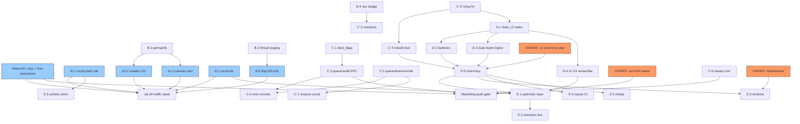

# Memba Feed v2 — The Definitive Implementation Plan

**Date:** 2026-07-13
**Status:** **FOR OWNER REVIEW — no implementation until owner go**
**Supersedes / continues:** `docs/planning/archive/shipped-2026-07/SOCIAL_FEED_UX_REVIEW_AND_DESIGN_2026-07-06.md` (§6–§10) and the roadmap annex `docs/planning/MEMBA_ROADMAP_COMPOUND_2026-07.md` (Part 4.1).
**Provenance:** synthesized from **4 ground-truth audits** (frontend, backend, realm, docs), an **8-lens expert panel** (social-product · ux · ui-visual · cto · gno-core · onchain-social · trust-safety · memba-ecosystem), and **3 live-prod verifiers** (feed is LIVE, moderation bearer UNSET, block_ts defect visible). Every capability claim in §1–§2 was verified in code this session; the panel's disagreements are preserved in the Appendix. **Revised after 3 adversarial verifiers (all GO_WITH_CHANGES); their required changes applied 2026-07-13.**

---

## 0. TL;DR for the owner (read this first)

1. **The feed is already public in prod** at `https://memba.samourai.app/feed` (`VITE_ENABLE_FEED` was flipped ON). It shows ~2 posts / 2 replies / 3 authors against test13. The "should we flip the flag" question is moot — **it's already flipped**. The urgent question is **safety catch-up**, and the ICO traffic wave hits **Jul 20** (7 days).
2. **The single takedown lever may be dead.** `FEED_MODERATION_BEARER` is **UNSET on Fly prod** — `POST /api/feed/moderation` 404s fail-closed. On a publicly writable, permanent-on-chain feed, that is **P0 owner action #1** (a 60-second `flyctl secrets set`).
3. **Every high-value feature converges on one immutable-realm event: the `memba_feed_v2` deploy.** Reactions (built, dark, would panic on the deployed realm), hot-key moderation, reposts, media CIDs, per-DAO channels, the flag-brigade fix, and the auth-antipattern migration ALL require a new realm path. Realms are immutable, so v2 is a **one-shot capability pour** — anything omitted costs a v3. The v2 spec IS the roadmap.
4. **But the launch is NOT chained to v2.** Posting / replies / threads / unfurls are the product and are live. The growth-push gate is closable **~90% backend-only**. Ship the safety catch-up + first-impression fixes now on v1; deploy v2 when the owner schedules the ceremony; hold the *marketing* push behind the full gate.
5. **The moat is real and already shipping:** on-chain object unfurls (the one thing X/IG/FB structurally cannot do) + soulbound reputation (`memba_points_v1`, live) next to every post. Double down on **discourse-first** (recommended D5 ruling); media rides behind v2's `CreatePost` media param.
6. **One "go with defaults" in §10 unblocks everything.** Every decision has a RECOMMENDED default.

---

## 1. State of the feed (honest, concise)

| Layer | Reality (verified this session) |
|---|---|
| **Prod flag** | `VITE_ENABLE_FEED` = **ON**. Feed is public today. Desktop nav shows "Feed · new". Mobile: NOT in the bottom-tab bar (buried under "More"). |
| **Frontend** | ~4,000 lines, Wave 1 + Wave 2 shipped **to spec** (see §2). ~95 feed-relevant unit test cases. Strong a11y + light/dark. **Zero flag-ON e2e** and no 375px invariant on the live surface. |
| **Backend** | Event-sourced indexer (`feed_raw_events` → idempotent `feed_posts`/`feed_reactions`), 7 public ConnectRPC reads, keyset pagination, `reply_count` denorm via triggers, fail-closed bearer moderation. Clean, no money-path coupling. |
| **Deployed realm (test13)** | **OLD build, commit `37f90ae` (Jul 4)** = source **minus** PR #61. qfuncs: Pause/Ownership/CreatePost/EditPost/DeletePost/FlagPost/ModRemovePost/UnhidePost/SweepTombstones/reads/Render. **NO reactions. NO moderator role.** ~2–4 live posts. Feed had **zero entries** in the 21/21 test13 ceremony — never redeployed. |
| **Realm source (deployer)** | `37f90ae + e8b90dc (#61)` = adds reactions (9-emoji fixed set) + moderator role. **Never deployed and cannot be, at the same path** (Gno realms immutable). `RepostOf` reserved but no entrypoint; `MediaCIDs` stored but `CreatePost` has no media param (dead schema). |
| **Dark flags (dangerous vs safe)** | `VITE_ENABLE_REACTIONS` = **FOOTGUN** (UI complete; deployed realm lacks `AddReaction` → every tap broadcasts a tx that **panics and burns the fee**). `VITE_ENABLE_LINK_PREVIEWS` + `MEMBA_ENABLE_LINK_PREVIEWS` = safe (degrade gracefully). `VITE_FEED_REALM_PATH` = the v2 cutover lever. |
| **Prod defect** | Pre-migration posts render **"block 671221"** instead of relative time (`block_ts=0`, never backfilled); newer posts show "6d" correctly. |
| **Moderation today** | On-chain reversal = **owner 2-of-2 multisig per post** (deployed realm has no moderator role). Serving-blocklist lever = **inert** (`FEED_MODERATION_BEARER` unset). |

**Genuinely strong — do not regress:** provenance chrome (mono for chain facts, Inter for prose, square "terminal" avatar tiles), SSRF-guarded link previews, tombstone-before-body render (mod-leak fix), typed unfurl cards, reply_count denorm + `content-visibility` perf, honesty-contract empty/error states.

---

## 2. Planned-vs-shipped matrix

Status legend: **SHIPPED** · **SHIPPED(dark)** · **PARTIAL** · **NOT-STARTED** · **NOT-STARTED(unblocked)**

| Item | Wave (orig) | Status | Evidence / note |
|---|---|---|---|
| block_ts deterministic time + relative render | W1 PR1 | SHIPPED | #775; memoized `RelativeTime` leaf + block tooltip. **Defect:** old rows `block_ts=0` (see §6). |
| Identity tile + `r/` name resolution | W1 PR4 | SHIPPED | #775; FNV-1a hue tile + `useActorUsernames`. Avatar-image swap (PR4 stretch) **never built**. |
| Reply notifications (RPC + surface) | W1 PR7 | **PARTIAL** | #775; **on-page surface only** — nav-level unread badge **never shipped**, so the come-back loop only fires for users already on /feed. |
| Flag that responds (optimistic + aria-live) | W1 PR5 | SHIPPED | #775; realm-panic surfacing. **have-I-flagged not durable** (per-mount useState). |
| Tombstone render (mod-leak fix) | W1 PR2 | SHIPPED | #775; covers thread root. |
| Permanence disclosure (compose + delete) | W1 PR3 + W2 | SHIPPED | #775 + #779. |
| a11y overlay-link + focus-visible + light-theme token | W1 PR6 | SHIPPED | #775; passes §13 CI gate. Minor gaps: no Esc/outside-click on menus, no focus trap on delete dialog. |
| Framed-canvas → two-pane rail | W1/W2 | SHIPPED | #788 supersedes framed column. |
| Infinite scroll + page-0 head poll + "N new" pill | W2 | SHIPPED | #777; thundering-herd avoidance documented. |
| Own-post edit/delete | W2 | SHIPPED | #779. |
| **Reactions (on-chain model a)** | W2 | **PARTIAL** | backend #800 + bar #802, **dark**; deployed realm has NO entrypoints → **realm-blocked on v2**. |
| Right rail: live stats + most-replied | W2 | SHIPPED | #785 + #787 + #788. |
| **sameContent reconciliation fix** | W2 | **NOT-STARTED** | `feedTypes.ts` L40–43 still plain author+body. (Audit-2's "closed" claim is **wrong** — its tests pin the broken predicate.) |
| On-chain object unfurls (generic + typed) | W2 §9 | SHIPPED | #780 realm/pkg; #789 token, #795 validator, #796 proposal. |
| Rich external link previews (SSRF + HMAC proxy) | W2/3 | SHIPPED(dark) | #799; dual-flagged. |
| **Reposts + quote-reposts** | W3 | **NOT-STARTED** | `RepostOf` reserved, no entrypoint → needs v2. Standing FeedGate "coming next" promise. |
| Rich text inline markdown | W3 | SHIPPED | #805; XSS-safe escape-first. |
| **Bare-URL / @mention / #hashtag linkify** | W3 | **NOT-STARTED** | `autolink:false`; deliberately deferred in #805. |
| **OG share cards for /feed/post/:id** | W3 | **NOT-STARTED** | only generic index.html OG; blog `applyArticleHeadMeta` (#866) never applied. |
| **Media posts (image→carousel→audio)** | W3 | **NOT-STARTED(unblocked)** | realm stores MediaCIDs but indexer drops them; proto has no field; #890 ships the upload/pin/serve pipeline. |
| **Follows + For-You/Following** | W3 | **NOT-STARTED** | no graph at any layer. FeedGate promises it. |
| **Per-DAO community feeds** | W4 | **NOT-STARTED** | DAO/Org membership realms exist as the hook. |
| Grid profile / Explore / creator profiles | W4 | **NOT-STARTED** | media-dependent. |
| **Activity-spine unification (Direction C)** | C/W8+ | **NOT-STARTED** | `classifyCall` already labels feed posts; `lib/activity.ts` fetch+humanize built client-side; union RPC unbuilt. |
| Realm `memba_feed_v1` (hardened) | 4.1 P0 | SHIPPED | deployer #56/#57, live test13. |
| Feed indexer + timeline RPCs | 4.1 | SHIPPED | #753. |
| /feed MVP + thread + profile | W7.2 | SHIPPED | #754 + #763. |
| `p/samcrew/modboard` shared pkg extraction | 4.1 | **NOT-STARTED** | **recommend CUT** — app store built its own path; consumer gone. |
| **Realm moderator role (hot-key)** | W8.2 PR2 | **PARTIAL** | source-only (#61); deployed realm lacks it → **realm-blocked on v2**. |
| **Flagged-content queue page** | W8.2 PR1 | **NOT-STARTED** | zero schema change needed (data already stored). |
| **Public audit-log view + policy doc** | W8.2 PR3 | **NOT-STARTED** | flagger addresses already in `feed_raw_events` attrs. |
| Serving-blocklist (operator takedown) | gate #2 | SHIPPED | #803; **post-id only, no CID variant; bearer UNSET in prod → inert.** |
| **Durable have-I-flagged state** | W2 f/up | **NOT-STARTED** | `PostCard` per-mount useState. |
| **Copy-link / permalink** | Dir-A | **NOT-STARTED** | the only Direction-A essential never shipped. |
| XP/points hooks (first-post quests) | 4.1 | **NOT-STARTED** | `memba_points_v1` live but inert (0 awarders). |
| Tipping / hold-to-post | 4.1 P3 | **NOT-STARTED** | deliberately behind SAFETY_GATED design; parked. |
| Reply-count denorm + render perf | §3 | SHIPPED | #832/#812/#820. |
| Activity bot (cold-start) | W7.3 | **PARTIAL** | #756 merged, **unwired** — correctly held behind growth gate. |
| **NFT unfurl kind** | C.1 | **NOT-STARTED** | token/validator/proposal/realm/link only. |
| **Flag-brigade asymmetry fix** | §6 panel | **NOT-STARTED** | FlagThreshold=5; reversal = multisig. Realm change → v2. |
| **MaxRepliesPerPost churn-refill** | §6 panel | **NOT-STARTED** | counts live, not lifetime. Realm change → v2. |
| **Reorg rollback deletes feed_reactions** | §3 backend | **NOT-STARTED(bug)** | `rollbackFeedFromHeight` misses `feed_reactions` despite idx built for it. One-line fix. |
| **rebuild-from-raw tool** | design promise | **NOT-STARTED** | no command exists; doubles as v2 cutover verifier. |
| **SweepTombstones cron** | gate #3 | **NOT-STARTED** | realm entrypoint exists; backend never calls it. |

---

## 3. Strategy

### 3.1 The v2 thesis — what makes this feed a moat

The panel converged hard on one framing (social-product, onchain-social, ui-visual, cto agree):

> **Memba is "Lens v1 semantics on a free-gas chain, served by a Bluesky-style AppView."** The realm is the shared, rebuildable data layer; the backend indexer is an AppView; the bearer blocklist is the operator's labeler. Full post bodies live on-chain — the thing Farcaster built hubs to *avoid* — but on a free-gas testnet that's a **legitimate differentiator, not a mistake**.

Three structural advantages no web2 feed can copy, all already shipping or one realm-field away:

1. **On-chain object unfurls as the supply engine.** Every proposal, token, validator, NFT, and app listing is a *latent post*. A one-tap "Share to feed" turns existing app traffic into feed supply at **zero content cost** — the honest cold-start asset (Instagram solved supply with filters; Memba solves it with the chain's own activity). Promote unfurls from "differentiator card type" to **the supply mechanism**.
2. **Soulbound reputation next to every post.** `memba_points_v1` is live (inert). No social product shows on-chain, non-transferable reputation on every identity. This becomes the native anti-spam economics (reputation-weighted flagging) *and* the strong signal (MP-backed Endorse) — Farcaster's storage-rent slot filled with reputation instead of money.
3. **Credible neutrality as a feature.** "Anyone can rebuild this feed from chain" + disclosed moderation-as-labeling (not silent deletion-at-serving) converts the feed's biggest decentralization embarrassment into its most credible claim — *if* rebuild-from-raw actually exists and moderation is disclosed.

### 3.2 The discourse-vs-media fork (D5) — RESOLVED: discourse-first

Asked twice since Jul-9, never ruled. **Every lens that touched it recommended discourse-first.** Resolution baked into this plan (owner confirms in §10, default = accept):

- The binding constraint at ~4 posts is **supply + distribution, not richness**. Media adds moderation liability (CID takedown, illegal content) exactly when we want a calm launch.
- #890 removed the *pipeline* blocker, but media is **realm-v2-gated regardless** (`CreatePost` has no media param — the plan's "the realm plumbing exists" claim was factually wrong).
- **Decision:** rule discourse-first. **Bake the media param into v2 anyway** (schema-stable, ~free) so images ride a fast-follow wave without a v3. Stop re-asking D5.

### 3.3 Minimum-lovable definition — what already justifies the live flag (catch-up, not go/no-go)

The flag is already ON. "Lovable" = the safety floor + first-impression floor before the Jul-20 traffic wave:

- **Safety:** `FEED_MODERATION_BEARER` set + drilled; on-chain moderation lever (multisig-only accepted for launch, v2 upgrades it); sweep cron; honest FeedGate/blog copy.
- **First impression:** block_ts backfill (kill "block 671221"); Feed in the mobile tab bar; copy-link permalink; nav unread badge; `GetFeedStats` cache; flag-ON e2e + 375px guard.
- **Content floor:** an **Ecosystem tab** (activity spine) so the feed feels alive at 4 posts with zero bots.

### 3.4 Non-goals / rejected ideas (with reasons)

| Rejected / cut | Reason |
|---|---|
| **Follows / For-You / Following tabs this quarter** | XL (needs `memba_graph_v1` realm + projection + tabs). For-You over 4 posts and Following over 0 edges *advertise* the ghost town. Cut; build later in a **separate** graph realm (never in feed_v2 — the feed needed v2 within 8 days; edges must outlive feed version bumps). |
| **§8 reaction model (c) "off-chain like"** | Would add the feed's **first authenticated user-write path** to a deliberately read-only backend (prod unsigned-auth is enforcing), create a second source of truth rebuild-from-raw can't cover, and forfeit the on-chain differentiator — all to dodge a gas cost that doesn't exist on test13. Keep on-chain reactions; the real fix is a **per-msg fee table**, and the strong signal is **MP-backed Endorse**. |
| **`blogMeta.ts` client-side OG for feed** | Social crawlers (X/Discord) don't execute JS → every shared link previews as generic Memba chrome, invisible in browser testing. Feed OG needs a **Netlify Edge Function** serving bot UAs. (Copy-link ships regardless; canvas share card is the real vector until the edge route lands.) |
| **`p/samcrew/modboard` shared pkg** | v1's internal 40-line `moderators` avl is tested + audited; app store built its own curation. Extraction cost now exceeds benefit. Carry the internal tree into v2. |
| **On-chain ImportPost/FinalizeSeed migration of the 4 posts** | Overkill for 4 test posts; an unsealed seed path is a **content-forgery backdoor**. Dual-watch keeps them visible via the projection at zero chain cost. (Seed code is *baked into v2 anyway* per GC-2 so the choice stays open until the ceremony — but default is fresh-start.) |
| **Audio media / grid profile / carousel this quarter** | Media-dependent, post-v2, discourse-first defers them. |
| **Hard on-chain DAO-membership gating for channels** | Adds a cross-realm dependency into immutable code. Ship `channel` as a **soft** attribute; gate at the serving/indexer layer; defer hard gating to a v3 decision. |
| **Farcaster-style hub federation / multi-operator relays** | Decentralization theater at this scale. One honest, disclosed AppView + a documented "run-your-own-indexer" path beats it. |

---

## 4. The realm-v2 decision

**Doctrine (the load-bearing correction to the original plan):** Gno realm immutability means capabilities must be **batched into rare, owner-gated deploy events**. The original "reserve a field, land the entrypoint in P1" strategy is *invalid* — `RepostOf` proved it (reserved, never landed, because an immutable realm can't grow an entrypoint). **v2 ships EVERY foreseeable capability in one shot**, even where no UI exists this quarter. A v3 six weeks after v2 is a process failure.

### 4.1 `memba_feed_v2` capability list (one-shot pour)

New path `gno.land/r/samcrew/memba_feed_v2` in `samcrew-deployer/projects/memba/realms/memba_feed_v2/`, forked from current v1 source (which already has reactions + moderator role), with these deltas:

**AUTH (mandatory — `check-antipattern-prevrealm.sh` forbids new baseline entries):**
- Delete all `unsafe.PreviousRealm()` / `unsafe.OriginCaller()`.
- `const AdminAddress = "g1…"` + `func init(){ owner = address(AdminAddress) }`; every crossing fn: `if !cur.IsCurrent() { panic("feed: external call") }; caller := cur.Previous().Address()`.
- 2-step `TransferOwnership`/`AcceptOwnership` (points_v1 admin.gno model). No banker anywhere.

**SIGNATURES (MsgCall args are flat strings → every new param is scalar):**
- `CreatePost(cur realm, body string, replyTo uint64, mediaCIDs string, channel string) uint64`
  - `mediaCIDs` = **comma-joined** (parse in-realm; CIDv0 base58 / CIDv1 base32 alphabets contain no comma). Validate: count ≤ 4, each 32–128 chars, charset check. Emit CIDs in `PostCreated`.
  - `channel` = "" (global) or ≤64 chars `[a-z0-9_-]`; indexed in a `byChannel` avl only when non-empty (zero cost for global posts).
- `Repost(cur realm, origID uint64, quote string) uint64` — resolves `RepostOf` to the **root** original (no chains); orig must be live; `quote` ≤ MaxBodyLen ("" = plain repost); plain reposts deduped one-per-`(addr,root)`; same cooldown as CreatePost. Emits `PostCreated` with `repostOf` attr (**one event type, no new dispatcher create-case**).
- `Endorse(cur realm, postID uint64, author address)` — **the MP-backed strong signal** (see §8 INT-6). One per `(addr,postId)`, per-day budget, no self-endorse, rejects hidden/deleted; cross-calls `memba_points_v1.Award(author, N, "feed:endorse:<id>")`. Requires owner to run `AddAwarder("gno.land/r/samcrew/memba_feed_v2")` on points_v1.
  - **FAIL-CLOSED WRITE (verifier fix):** the cross-realm `memba_points_v1.Award` **WRITE must fail CLOSED** — if `Award` panics, the whole `Endorse` tx **aborts**. Do **NOT** `recover()` it. A swallowed `Award` panic silently drops the MP mint while showing the user a successful endorsement — the two behaviours must never be conflated. The **only** fail-*open* path is the *separate*, read-only `RankOf` flag-weight lookup inside `FlagPost` (points read error → weight 1; see §7.1) — that is a different call and must not be used to justify swallowing the `Award` panic.
  - **MANDATORY PRE-FREEZE SYBIL ANALYSIS (immutable-code blocker — §10 D19, §9 risk row):** before the v2 freeze, complete and **record** a *quantitative closed-loop sybil analysis*. A mutual-endorsement ring can farm soulbound MP within the daily budget, cross tier thresholds over time, and — *if MP is allowed to raise `FlagPost` weight* — re-acquire amplified brigade power, defeating the weighted-flagging fix (§7.1). **Mitigation, baked into this immutable `Endorse`/flag path: DECOUPLE endorse-derived MP from flag weight, or hard-cap the endorse→rank→flag-power path.** `points_v1.assertAwardAuth` trusts the *whole* awarder flow (verified `points.gno` L69–80) → **ALL anti-collusion must live in feed_v2's immutable code; it cannot be patched into `points_v1` later.**
  - *(Owner may split this into a separate `memba_feed_endorse_v1` awarder realm — see §8 — but baking it into v2 avoids a second ceremony.)*

**REACTIONS:** keep the v1 subsystem but (a) move `reactionEmojis` into an avl seeded with the 9, add owner-gated `AddReactionEmoji(cur, emoji)` capped at 24 (kills "emoji churn = v3"); (b) **REMOVE `touchFirstSeen()` from AddReaction** (revert #61's flag-age-farming erosion — a reaction must not mint flag rights).

**MODERATION:** keep #61's moderator role (`AddModerator`/`RemoveModerator`/`IsModerator`, owner-or-moderator auth on `ModRemovePost`/`UnhidePost`) — this is the growth-gate hot-key lever.

**SPAM HARDENING (fold the two open §6 panel findings + the T&S rider):**
- **Reply cap = hybrid:** keep live cap 500 (B1 render bound) + add `lifetimeReplies` avl (increment-only) capped ~2000 + **per-author-per-post cap ~25** (the per-author cap is the actual anti-bomb lever; pure lifetime counting lets a bomber permanently freeze any thread).
- **Weighted flagging:** `FlagPost` weight = 1 + tierBonus (young flaggers count 1, established count 2), threshold integerized to ~10–12 weighted units — five 0-MP aged sybils can no longer auto-hide. Optional reputation weighting via read-only `memba_points_v1.RankOf` with a **fail-open fallback** (points error → weight 1) — **subject to the D19 decoupling: reputation may raise weight ONLY if the endorse→MP→flag-power loop is capped/decoupled per the sybil analysis above.** *(If cross-realm coupling is rejected at review, fall back to a raised flat threshold + indexer-side "contested" serving state.)*

**KNOBS:** `FlagThreshold` / `MinAccountAgeForFlag` / `FlagsPerDayBudget` / cooldowns become **owner-settable vars clamped in hard-coded min/max bounds** via `SetSpamKnob(cur, name, v)`, emitting `ConfigChanged(name, old, new)`. Only the *bounds* require a v3. Tests pin the bounds, not the values.

**ERROR SURFACE:** standardized `feed:`-prefixed panic strings so the three brittle frontend regex classifiers (`FeedComposer` L62–69, `PostCard` L34–46) collapse into one `lib/feedErrors.ts`.

**SEED (baked; HARD-gated at ceremony):** `ImportPost(cur, origID, author, body, replyTo, origBlockH)` owner-only while `!seedFinalized`; `FinalizeSeed(cur)` irreversible latch; all writes `assertSeedFinalized()`. **`ImportPost` is a permanent content-forgery capability, so `FinalizeSeed` is a NON-SKIPPABLE ceremony gate — not merely a "recommended default".** The ceremony MUST (a) call `FinalizeSeed` (whether or not any `ImportPost` ran), (b) **assert `seedFinalized==true` via qeval BEFORE any UI repoint**, and (c) **smoke-test that a post-finalize `ImportPost` aborts**. *Never repoint the UI at an unsealed realm.* (See §4.2 step 4, D.4 checklist lines, §10 D4.)

**ID COLLISION (the hidden cutover blocker):** v1 and v2 both count post ids from 1; `feed_posts` is keyed on `post_id` alone. **Cheapest fix: init v2 with `nextPostID = 1_000_001`** (realm one-liner) so id spaces never collide — no `feed_posts` realm-column migration needed, post URLs stay single ints. *(Alternative: add a `realm` column; more invasive.)*

### 4.2 Migration / ceremony plan (owner-gated, cannot be autonomous)

Runbook `samcrew-deployer/projects/memba/FEED_V2_CEREMONY_RUNBOOK.md` (clone `POINTS_V1_CEREMONY_RUNBOOK`), in order:
1. Pre-deploy adversarial review doc (`REALM_PREDEPLOY_REVIEW` pattern) + `gno test` + `gno lint` + `check-antipattern-prevrealm.sh` (ZERO new entries) all green. **Includes the recorded closed-loop sybil analysis (§4.1 / D19) as a sign-off artifact.**
2. `realms.manifest` default-lane entry for v2 (**keep** the v1 line — deploy.sh skips already-deployed).
3. Deploy: `DEPLOY_KEY=samcrew-core-test1 MULTISIG_SIGNERS=zooma,adena-zxxma ./projects/memba/deploy.sh test13` (owner-signed 2-of-2).
4. **Migration policy — HARD-gated (§4.1 SEED, §10 D4):** call `FinalizeSeed` (fresh start — DEFAULT; or `ImportPost×N` first). **This gate is non-skippable:** immediately after, **assert `seedFinalized==true` via qeval** and **smoke-check that a further `ImportPost` aborts** — BOTH before any repoint (step 7). `ImportPost` is a permanent content-forgery capability; an unsealed realm must never see traffic.
5. **Owner-signed on-chain grants — BOTH batched into THIS single sitting:** (a) multisig `AddModerator` on v2 — **the growth-gate moderation-lever unlock**; (b) `AddAwarder("gno.land/r/samcrew/memba_feed_v2")` on `memba_points_v1` — makes the feed points_v1's **first vetted awarder** so `Endorse` can mint MP. *(If Endorse is split into a separate `memba_feed_endorse_v1` awarder realm per the D6 dissent, `AddAwarder` targets THAT realm instead.)*
6. Fly env: `FEED_WATCHED_REALMS=…memba_feed_v1,…memba_feed_v2` + pre-seed the v2 `feed_indexer_state` cursor row at deploy height (or set `FEED_START_BLOCK` near it — the min-cursor-across-realms gotcha otherwise forces a full rescan).
7. Netlify: `VITE_FEED_REALM_PATH` → `gno.land/r/samcrew/memba_feed_v2`.
8. Smoke: post/reply/edit/delete/flag/react/repost/endorse/mod-remove/unhide/sweep(1) on test13, **recording gas_used per entrypoint** into the runbook (feeds the §5 fee table).
9. `PauseRealm` on v1 (sunset the dead write path — frontend already repointed).
10. **ONLY THEN** flip `VITE_ENABLE_REACTIONS` (test13 only).
11. Post-cutover: remove the `memba_feed_v1` line from `antipattern-prevrealm-baseline.txt` to lock the migration in.

**This is still ONE ceremony:** both owner-signed on-chain actions (`AddModerator` on v2 + `AddAwarder` on points_v1) are batched into the single owner-present multisig sitting — no second ceremony. **Deployer is a SHARED CHECKOUT — worktrees only, never `git add -A`.** Steps 4→7 ordering is load-bearing (repointing before the sealed-seed assertion violates the unsealed-realm rule; flipping reactions before step 7 aborts on-chain).

### 4.3 What stays v1-compatible

- The UI reads **only** the `feed_posts` projection → the ~4 v1 posts stay visible via dual-watch with **zero chain work**.
- Every v1 event **name** is preserved (`PostCreated`/`PostEdited`/…/`ReactionAdded`) so `feed_dispatch.go` cases keep working; v2 extends **additively** (new attrs `mediaCids`/`channel`/`repostOf`, a trailing `sv="2"` schema-version attr).
- `Endorse` and any external referencer key on postIds, so they work against v1 posts and any v2 — **not chained to the cutover**.

---

## 5. Wave plan

Lanes: **A = frontend**, **B = backend/realm/ops**. Every PR is TDD, dark-shippable, flag-gated, sized **S/M/L**. Sequenced so the **owner ceremony is the only serialization point**.

**Scope reality (verifier correction):** this plan enumerates **40 PRs across 8 sub-waves** — realistically **8–12 sessions, NOT 3**. The **first ~3 sessions** cover **Wave A0 + Wave A1 + the pre-Jul-20 subset of Wave B** (everything the Jul-20 traffic wave actually touches). Waves C/C′ (moderation), D (memba_feed_v2), E (post-v2 flips) and F (integrations) are **post-launch**.

**🗓️ Jul-20 critical path — must land BEFORE the ICO traffic wave:**
- **Wave A0:** `A0.1` block_ts backfill · `A0.2` mobile tab bar · `A0.3` copy truth-up · `A0.4` blog fix.
- **Pre-Jul-20 subset of Wave B:** `B.1` reconciliation · `B.2` thread paging · `B.3` permalink · `B.4` nav badge · `B.5` stats cache · `B.6` flag-ON e2e + 375px.
- **Wave A1 (first-impression & distribution):** `A1.1` Ecosystem tab (content floor) · `A1.2`/`A1.3` crawler OG + canvas share card (distribution).
- **Owner, in parallel:** set + drill `FEED_MODERATION_BEARER` (P0, §6.1.1).
- **Everything else is POST-LAUNCH** and NOT chained to Jul-20 (Waves C/C′/D/E/F).

### Wave A0 — Pre-Jul-20 critical path (this week)

The two highest-visibility first-impression fixes (promoted out of §6.1 prose into numbered PRs) + the two copy-honesty fixes.

| # | PR | Layer | Effort | Depends on | Core work | Key tests | Flag |
|---|---|---|---|---|---|---|---|
| A0.1 | **block_ts backfill** | A/B | S | — | Kill the visible "block 671221": backfill old `feed_posts` rows' `block_ts` via `/block?height=N` (or a rebuild-from-raw pass once the C′.4 tool exists); newer rows already correct. High-visibility, cheap. | old rows render relative time; no "block NNN" | — |
| A0.2 | **Feed in the mobile bottom-tab bar** | A | S | — | The flagship new surface is in `MORE_NAV_IDS` but **absent from `mobilePrimaryTabs`** (verified) → buried under "More". Add Feed alongside Home/DAOs/Tokens/Directory before the Jul-20 wave. | Feed tab renders in bottom bar at 375px; routes correctly | `VITE_ENABLE_FEED` |
| A0.3 | **FeedGate + routeMeta copy truth-up** | A | S | — | Remove "appeal" (no appeal flow exists) and "Follows and reposts (coming next)" (both realm-v2-gated); soften "single global timeline" until the Ecosystem tab (A1.1); fix routeMeta "follow the conversation". | copy snapshot; no promise of undeployed features | — |
| A0.4 | **Blog correction (owner-approved)** | A | S | — | Edit indexed `2026-07-08-social-feed.md`: reactions/link-previews are dark+realm-blocked, not present-tense; "reactions realm" claim is factually wrong. | n/a (content) | — |

**DoD (Wave A0):** no false public promises before traffic; the two cheapest first-impression fixes shipped; owner sets + drills `FEED_MODERATION_BEARER` (P0, §6.1.1) in parallel.

### Wave A1 — Pre-Jul-20 first-impression & distribution

The plan's own answer to "feels alive at 4 posts for the ICO wave" (content floor) + "shared links render as Memba, not generic chrome" (distribution). These are pre-Jul-20, **not** parked last. *Note: A1.2/A1.3 consume the permalink from B.3 — itself a pre-Jul-20 item — so within the sprint B.3 lands first.*

| # | PR | Layer | Effort | Depends on | Core work | Key tests | Flag |
|---|---|---|---|---|---|---|---|
| A1.1 | **Ecosystem tab v0 (Direction C lite)** | A | M | — | Posts \| Ecosystem tabs on FeedPage; Ecosystem = read-only merged chain activity via `lib/activity.ts` (built) + `ActivityCard`; **Ecosystem-first default while volume low**. Makes "single global timeline" copy TRUE — content floor so the ICO wave lands on a feed that feels alive, not 4 posts. | tabs render; ecosystem-first default; activity interleave | `VITE_ENABLE_FEED` |
| A1.2 | **Crawler OG (Netlify Edge Function)** | B | M | B.3 | `netlify/edge-functions/feed-og.ts` matches bot UAs, builds og:* from `GetFeedThread`, **honors tombstone/blocklist** (moderated content never leaks off-platform). Cache 60s, bot-UA-only pass-through. | bot-UA gets og tags; human unaffected; tombstone/blocklist never leaks | — |
| A1.3 | **Canvas share card** | A | M | B.3 | LIGHT "Riso Protest" branded PNG (BARRICADE #904 / `ShareCard` pattern) for X/Telegram; the real distribution vector until A1.2's edge route lands. | card renders; correct permalink; brand tokens | `VITE_ENABLE_FEED` |

**DoD (Wave A1):** the ICO wave lands on a feed that reads as alive (Ecosystem interleave) and on shared links that render as Memba (edge OG + canvas card), not generic chrome.

### Wave B — hygiene & launch safety net (now, frontend/backend, zero owner gate)

S-cluster hygiene + launch safety net. `B.1–B.6` are the **pre-Jul-20 subset**; `B.7` is polish that can trail.

| # | PR | Layer | Effort | Depends on | Core work | Key tests | Flag |
|---|---|---|---|---|---|---|---|
| B.1 | **sameContent reconciliation fix** | A | M | — | `makeOptimisticPost` **already** takes a client `nonce` (`feedTypes.ts` L21) and `FeedComposer` already passes it (L58) — but the nonce is **client-only and can NEVER equal a server post id, so it is useless for server reconciliation**. The fix is purely the correct heuristic: reconcile "server post newer than my optimistic ts by the same author" + a **30s TTL** that clears stuck optimistic rows. Rewrite `feedTypes.ts` `sameContent` (L40–43) + its tests (which currently pin the broken author+body predicate). | identical-body posts don't vanish/collapse; never-matching row clears at TTL | `VITE_ENABLE_FEED` |
| B.2 | **Thread reply pagination** | A | S | — | `FeedThread` stop discarding `nextCursor`; convert to `useInfiniteQuery` (mirror FeedPage) + "Show more replies". | 51+-reply thread loads more; empty state intact | `VITE_ENABLE_FEED` |
| B.3 | **Copy-link permalink** | A | S | — | "Copy link" in PostCard manage menu + share icon in footer → `navigator.clipboard` `${origin}/feed/post/:id` + toast; Safari textarea fallback. | correct URL copied; tombstone posts still copyable | `VITE_ENABLE_FEED` |
| B.4 | **Nav-level reply badge (finish PR7)** | A | M | — | Lift `GetReplyNotifications` poll into `lib/useReplyNotifications.ts`; mount once in app shell (gated `VITE_ENABLE_FEED && connected`); count-dot on Feed nav item, cap "9+"; clear on /feed visit via existing `markLastSeen`. One shared poll app-wide (dedupe queryKey). | badge renders; clears on visit; disconnected = no poll | `VITE_ENABLE_FEED` |
| B.5 | **GetFeedStats singleflight cache** | B | S | — | Wrap the 3 COUNT(*) + most-replied in the `home_rpc` singleflight pattern (30–60s TTL). | cache hit path; TTL expiry refresh | — |
| B.6 | **Flag-ON e2e + 375px invariant** | B(test) | M | B.2 | New `e2e/feed-live.spec.ts` with `.env.e2e-feed` (`VITE_ENABLE_FEED=true`, `.env.development.local` naming discipline) + `abortOnchainReads` stubbed fixtures (25-post incl. tombstone, unfurl, 51-reply thread). Assert timeline render/scroll, thread + "show more", tombstone never leaks body, N-new pill, and `body.scrollWidth<=380` on /feed, /feed/post/:id, /feed/user/:addr. | all above; deterministic via abortOnchainReads | — |
| B.7 | **Menu/dialog a11y + dead-code sweep** | A | S | — | `useDismissable(ref,onClose)` (Esc + outside-click) for manage menu + reaction picker; focus-move/trap on delete alertdialog; `aria-label` on composer/edit textareas. Delete 3 dead feed.css blocks (L926/L939/L163) + fix stale `feed.ts` "not yet wired" comments. | Esc closes; focus trapped; axe clean | `VITE_ENABLE_FEED` |

**Note — A.2 (interim localStorage have-I-flagged) CUT (verifier change):** the throwaway per-address localStorage set would be ripped out the *same cycle* by C.1's `feed_flags` projection (the real durable-flag fix). Going straight to the projection avoids build-then-delete. If the re-flag popup is judged a launch embarrassment, **pull C.1 forward into the pre-Jul-20 sprint** (it is backend-only) rather than build the throwaway. Default = cut.

**DoD (Wave B):** the verified-open sameContent reconciliation closed (B.1); durable have-I-flagged is delivered by the C.1 projection, not throwaway localStorage (A.2 cut); live feed has a flag-ON e2e + 375px guard; the only uncached hot read is cached; distribution primitive (permalink) + retention primitive (nav badge) shipped; no dead code. All green under `eslint --max-warnings=55` + `npm run build` + vitest.

### Wave C — moderation closeout, gate-critical (before the marketing push; zero realm change)

The growth-gate moderation stack (§6.4). Post-Jul-20.

| # | PR | Layer | Effort | Depends on | Core work | Key tests | Flag |
|---|---|---|---|---|---|---|---|
| C.1 | **feed_flags projection + durable have-I-flagged** | B | M | — | Migration **024** `feed_flags(post_id, flagger_addr, event_block)` populated in `applyFeedPostFlagged` from the `flagger` attr the dispatcher currently discards (backfillable from raw). Fold `viewer_has_flagged` into GetFeedTimeline/Thread (viewer addr param) → **this is the real durable-flag fix that replaced the cut A.2 localStorage**. | flagger projected; viewer flag state correct; backfill idempotent | `VITE_ENABLE_FEED` |
| C.2 | **Quarantine-vs-tombstone + serve-override** | B | M | — | Migration **025** adds `hidden_cause` ('flags'\|'mod') derived from event path; `feed_serving_overrides` table; extend `/api/feed/moderation` with `serve_override`/`clear_override` (same bearer). Read paths: flag-hidden + no override → serve WITH body + proto `quarantined=true`; mod-hidden/blocklisted keep tombstone. | 5-sybil brigade → interstitial reversible by 1 curl; mod-hide stays hard | `VITE_ENABLE_FEED` |
| C.3 | **Flagged queue + audit-log RPCs** | B | M | C.1 | `GetFlaggedPosts` (flag_count>0 OR hidden=1, keyset, includes hidden_cause/override/blocklist status) + `GetModerationLog` (ModAction + PostFlagged + blocklist rows from raw attrs; **public, ids+reasons only, never bodies**). | queue ordering; log body-free by construction | — |
| C.4 | **Moderation console UI** | A | M | C.3, C.2 | `/feed/mod` route (`FeedModQueue`, `FeedModAuditLog`) behind `VITE_ENABLE_FEED`; actions call the bearer endpoint with an **operator-pasted bearer in sessionStorage** (never localStorage, never baked into build); interstitial → quarantine reveal. | queue renders; action posts; bearer never persisted to localStorage | `VITE_ENABLE_FEED` |
| C.5 | **/feed/transparency + policy** | A | S | C.3 | Public read-only audit log + `docs/MODERATION_POLICY.md` (what's removed, how, report contact, GDPR/erasure posture). Backs FeedGate's honest "operator-reviewed" copy. | policy route renders; log body-free | — |
| C.6 | **SweepTombstones cron** | B | M | — | Grow `cmd/activitybot` with a `sweep` action calling the realm `SweepTombstones` via the house-safe **gnokey key-by-NAME** pattern (kill-switch env, bounded per-run cap, **dry-run default**), on a Fly scheduled machine. Dedicated sweep-only account, zero other privileges. | dry-run default; kill-switch; bounded cap | — |
| C.7 | **Abuse metrics + alert** | B | S | — | METRICS_BEARER-gated: flags/hour, unique flaggers/day, auto-hides/day, posts/hour by distinct authors (one SQL each). Wire one threshold alert into gnomonitoring. | each metric query; alert fires at threshold | — |

**DoD (Wave C):** the growth-gate moderation stack is live — bearer set+drilled (§6.1.1), queue/audit/console + published policy + sweep cron + abuse metrics + quarantine/serve-override — moderation is **disclosed-labeling not silent deletion**; a brigade is reversible with 1 curl; **zero realm deploy**.

### Wave C′ — rebuild, erasure & v2-prep (backend; gates the v2 track)

Data-integrity, GDPR erasure, retention, and the two v2-cutover dependencies (reorg fix + rebuild tool moved out of the "now" wave). `C′.3`/`C′.4` gate Wave D.

| # | PR | Layer | Effort | Depends on | Core work | Key tests | Flag |
|---|---|---|---|---|---|---|---|
| C′.1 | **Erasure action + raw-event scrub** | B | M | C.2 | `erase` action on `/api/feed/moderation`: blocklists AND scrubs body from `feed_posts` and `feed_raw_events` attrs (idempotent redaction marker the dispatcher treats as tombstone on replay). Without this, rebuild-from-raw resurrects "erased" content and the GDPR position collapses. | scrub survives rebuild; marker replay-idempotent | — |
| C′.2 | **@mention notifications (backend-only)** | B | M | B.4 | Parse bodies at ingest in `applyFeedPostCreated/Edited` → `feed_mentions(post_id, mentioned_addr)` (**store the resolved address**, not the handle, so renames don't break); `GetMentionNotifications` cloning the since_id contract; merged into the nav badge. Linkify @handles in `markdownLite` via existing opts (resolve via `useActorUsernames`). Hashtags out of scope. | mention detected; address stored; badge merges | `VITE_ENABLE_FEED` |
| C′.3 | **Reorg reactions delete (backend bug)** | B | S | — | `rollbackFeedFromHeight` (`feed_tailer.go:252`): add `DELETE FROM feed_reactions WHERE event_block >= ?` (idx 020 exists for exactly this). **Moved out of the "now" wave (verifier change): a reorg that deletes reactions is unreachable until reactions exist on v2 — this is a dependency of the rebuild tool (C′.4) and the v2 cutover, not a pre-Jul-20 item.** | reorged reaction removed; no phantom row | — |
| C′.4 | **cmd/feedrebuild (rebuild-from-raw tool)** | B | M | C′.3 | Truncate `feed_posts`/`feed_reactions`/`feed_flags` (NEVER `feed_blocklist`) + replay `feed_raw_events` in (block,tx,idx) via the **production dispatcher** (not a parallel path); `--verify` mode diffs temp tables vs live. Doubles as the v2 cutover verifier. Refuses to run unless tailer stopped. | rebuild == live; verify diff clean; blocklist untouched | — |

**DoD (Wave C′):** feed is rebuildable and GDPR-defensible (erasure survives rebuild; the tool never touches `feed_blocklist`); "someone said your name" retention beats "someone reacted"; the reorg-reaction bug + rebuild tool (the v2-cutover verifier) are ready — **the v2 track (Wave D) can now proceed.**

### Wave D — memba_feed_v2 (spec+build now in parallel; DEPLOY owner-gated)

| # | PR | Layer | Effort | Depends on | Core work | Key tests | Flag |
|---|---|---|---|---|---|---|---|
| D.1 | **Author memba_feed_v2 realm** | B | L | C′.3 | Full §4.1 capability pour: cur.IsCurrent auth + AdminAddress, CreatePost(mediaCIDs,channel), Repost, **Endorse (Award WRITE fail-CLOSED; sybil-decoupled per §4.1/D19)**, extensible reactions (no touchFirstSeen), moderator role, hybrid+per-author reply caps, weighted flagging (RankOf read fail-open), clamped knobs, feed:-prefixed panics, **HARD-sealed seed importer**, `nextPostID=1_000_001`. **TDD: batteries land in D.2.** | see D.2 | — (source) |
| D.2 | **v2 adversarial test batteries** | B | L | D.1 | Port 7 v1 test files to cur.Previous auth + ADD: b3_repost (hidden/deleted abort, repost-of-repost→root, dedup, quote>max), b4_media (5 CIDs abort, 129-char abort, charset abort, empty OK), b5_lifetime_cap (**the churn-refill regression**: 500 live + refill until 2000 lifetime, per-author 25), b6_seed (write-before-Finalize abort, dup import abort, **post-finalize ImportPost abort**), b7_flag_anchor (reaction does NOT create firstSeen), b8_knobs (clamp bounds, non-owner abort, ConfigChanged), b9_endorse (self/dup/budget, **Award panic → whole tx aborts = fail-closed; RankOf read fail-open = weight 1**), **b10_sybil (closed-loop endorsement-ring CANNOT amplify flag weight — the §4.1/D19 decoupling)**. `gno test` + `gno lint` + ratchet zero new entries. | all above; bounds-pinned not value-pinned | — |
| D.3 | **Event schema v2 + dual-realm ingest** | B | M | D.1 | Dispatcher parses `mediaCids`/`channel`/`repostOf` → `feed_posts` columns (migration **026** additive: media_cids TEXT, channel TEXT, unreserve repost_of); unreserve FeedPost proto field 5 + add media_cids/channel/endorse_count; new dispatcher cases for PostEndorsed/PostImported/SeedFinalized/ConfigChanged. Pre-seed v2 cursor. | additive migration idempotent; dual-watch no id clobber (verified via C′.4) | — |
| D.4 | **v2 UX requirements annex + fee table** | A/B | M | D.1 | One-page annex binding into the ceremony: gas measured per entrypoint; **AddReaction idempotent no-op on duplicate** (double-tap can't burn a fee); no touchFirstSeen; mainnet reaction-economics decision captured BEFORE freeze; **FinalizeSeed hard-gate assertions (§4.2 step 4) enumerated as non-skippable ceremony checklist lines** (assert `seedFinalized==true` + post-finalize `ImportPost`-abort smoke, both before repoint). `gasConfig.ts` per-msg table **structure defined here — consumed by E.1 just before reactions go live** — tuned from measured gas (reaction ~2–3M vs post 10M). | fee table structure; annex checklist incl. seal-gate lines | `VITE_ENABLE_REACTIONS` |
| D.5 | **Ceremony runbook + cutover** | B | M | D.2, D.3, C′.4 | §4.2 runbook; owner-present multisig deploy + **AddModerator (v2) + AddAwarder (points_v1) batched into ONE sitting** + **HARD FinalizeSeed gate (assert `seedFinalized==true` + post-finalize ImportPost-abort smoke BEFORE repoint)** + dual-watch + repoint + smoke + PauseRealm v1. | rehearsed dry-run; C′.4 verify green pre-repoint; seal-gate asserted pre-repoint | — |

**DoD (Wave D):** v2 deployed with every foreseeable capability, adversarially reviewed (incl. the recorded closed-loop sybil analysis §4.1/D19); the 4 v1 posts survive via dual-watch; reactions/reposts/moderator role become real; `VITE_ENABLE_REACTIONS` becomes safe to flip on test13. **Nothing forgotten that would force a v3.**

### Wave E — post-v2 feature flips (each an independent flag flip on v2)

**E.1 lands FIRST, immediately before reactions go live** — deliberately deferred from the "now" wave to keep production write paths untouched through the Jul-20 spike.

| # | PR | Layer | Effort | Depends on | Core work | Key tests | Flag |
|---|---|---|---|---|---|---|---|
| E.1 | **feedTx optimistic layer + per-action fee table (structure)** | A | L | D.5, B.1 | New `lib/feedTx.ts`: `submitOptimistic({apply,rollback,msg,memo,action})` — sync UI apply → background Adena popup → rollback+toast on abort; returns tx hash. Centralize the reject-regex (fixes "brittle regex in 3 places"). `gasConfig.ts` gains `getGasConfigFor(action)` table (today's defaults as fallback; reaction tuned at ceremony per D.4). Migrate composer/flag/delete/edit onto it. **Batch the reactions query** out of per-post `ReactionBarInner` into FeedPage/FeedThread (kills 20 calls/page). **Moved here from the "now" wave (verifier change): this refactors LIVE write paths whose only payoff is reactions (v2-gated), so refactoring them days before the ICO spike is pure regression risk for zero pre-Jul-20 value — it lands immediately before reactions go live.** | optimistic apply+rollback; monotonic op-id; batched reactions | `VITE_ENABLE_FEED` |
| E.2 | **Reactions live** | A | S | E.1 | Flip `VITE_ENABLE_REACTIONS` on test13; ReactionBar uses the E.1 optimistic layer + D.4 fee table; client `HasReacted` gating so a dup tap never reaches the wallet. | optimistic bump; dup-gated; rollback toast | `VITE_ENABLE_REACTIONS` |
| E.3 | **Endorse (MP strong signal)** | A/B | M | D.5, points AddAwarder (D.5 step 5b) | `EndorseButton` beside ReactionBar (weighty treatment); `feed_endorsements` projection + `GetPostEndorsements` batched; endorsed-by facepile. Surface the fail-closed Award behaviour (endorse fails visibly if the mint aborts). | endorse count; budget enforced; no self-endorse; Award fail-closed surfaced | `VITE_ENABLE_ENDORSE` |
| E.4 | **Quote/repost UI** | A | M | D.5 | Plain repost topline + quote "specimen card" (double-hairline, NOT dashed — dashed = tombstone), 1-level nest cap, quoted-tombstone never leaks body (**TDD first — moderation-bypass class**). | quoted-tombstone leak blocked; depth cap | `VITE_ENABLE_FEED` |
| E.5 | **Feed media (images only)** | A/B | L | D.5, D5 ruling, upload-auth decision | Indexer already carries media_cids (D.3). Composer mounts `ImageUploader` (#890); PostCard `PostMediaGrid` (1–4, aspect-locked, mono CID stamp). markdownLite images stay OFF (attachments only). **HARD GATE, same PR:** feed media serves through a **NEW allowlist-gated handler** (`uploaded_cids`, default-deny) — **NOT the existing `/api/nft/image` (`HandleNFTImage`, `ipfs_serve.go`), which enforces ZERO allowlist/blocklist and will fetch+serve ANY cid (verified in source)** — plus `cid_blocklist` enforcement on that same serving path + `cid` action on the moderation endpoint + upload-time sha256/pHash (see §7 TS3). | allowlist default-deny on the feed serve path; blocklisted CID stops serving + purges; `/api/nft/image` NOT reachable from feed media; 375px grid | `VITE_ENABLE_FEED_MEDIA` |
| E.6 | **Activity spine v1.5 (union RPC)** | B | M | A1.1 ships v0 | `GetMembaActivity` union over feed_posts + Home event sources behind the singleflight cache (the caching optimization; v0 is frontend-only in Wave A1). | per-source keyset pagination; diversity caps | `VITE_ENABLE_FEED` |

### Wave F — Integrations & growth surfaces (frontend-lite, mostly realm-free; see §8)

| # | PR | Layer | Effort | Depends on | Core work | Flag |
|---|---|---|---|---|---|---|
| F.1 | **MP tier badges (read-only)** | A/B | S | INT-1 | tier chip on PostCard/FeedProfile via `GetPointsProfiles` (cached qeval); dark until holders exist. | `VITE_ENABLE_POINTS` |
| F.2 | **Feed quests (indexer-verified)** | B | M | growth gate | first-post/thread-starter/conversationalist verified against `feed_posts` (no stubs); XP via existing attestation voucher. | quest catalog flag |
| F.3 | **Share-to-feed intents** | A | S | F.4 | `?compose=<encoded link>` prefill (sanitized, never auto-post) on proposal/token/validator/NFT/app-listing surfaces. | `VITE_ENABLE_FEED` + producer flags |
| F.4 | **App + NFT unfurl kinds** | A | M | — | extend `feedUnfurl` union with `app`/`nft`; render via listing RPC + `/api/nft/image` (read-only NFT thumbnail, no buy button). | `VITE_ENABLE_FEED` |

### Parked (low-impact/high-effort or explicitly cut — do NOT start without owner override)
- **Follows / For-You / Following + `memba_graph_v1`** (XL, cut this quarter — §3.4).
- **Per-DAO community feeds UI** (channel field baked into v2; UI is Wave-4-later; launch ≤3 seeded channels or it ships to an empty room).
- **Audio media, grid profile, Explore/trending, creator profiles** (media-dependent, post-discourse).
- **Unified identity card across feed/directory/points** (nice-to-have; INT-8, after tier badges).
- **Tipping / hold-to-post** (SAFETY_GATED design, deliberately parked).
- **NCMEC/IWF/PhotoDNA hash lists** (org-level legal commitment; interim = allowlist + internal pHash + Cloudflare scanning).

---

## 6. Live-prod catch-up & growth

**The feed is already live.** These are catch-up items, not a go/no-go gate.

### 6.1 P0 safety catch-up (owner + this-week engineering)
1. **[OWNER, minutes] Set `FEED_MODERATION_BEARER` on Fly prod** + run the drill: block one live post, verify it vanishes from all 7 read paths, unblock, verify restore. Record in `FEED_MODERATION_RUNBOOK.md`. **Gate item flips DONE at *drill*, not merge.** (Same visit: the long-standing `METRICS_BEARER` / `QUEST_ADMIN_ADDRESSES` warnings.)
2. **block_ts backfill** → **shipped as A0.1** (kill the visible "block 671221"; backfill old `feed_posts` rows via `/block?height=N`).
3. **Feed in the mobile bottom-tab bar** → **shipped as A0.2** (flagship surface buried under "More" — in `MORE_NAV_IDS` but absent from `mobilePrimaryTabs`).
4. **Copy fixes** → **shipped as A0.3/A0.4** (stop the false "appeal / follows & reposts coming next / reactions live" promises before traffic arrives).
5. **Record next to the Netlify flag:** `VITE_ENABLE_REACTIONS` = **DO NOT FLIP until feed_v2** (footgun — panics on the deployed realm).

### 6.2 Pre-Jul-20 first-impression fixes
- The pre-Jul-20 subset of Wave B: B.3 copy-link, B.4 nav badge, B.5 stats cache, B.6 e2e+375px, B.1 reconciliation, B.2 thread pagination.
- A1.1 Ecosystem tab (content floor so the ICO wave lands on a feed that feels alive, not 4 posts).
- A1.2/A1.3 distribution (OG edge function + canvas share card) so ICO-driven shares render as Memba, not generic chrome.

### 6.3 Cold-start / seeding plan (no bots until the gate closes)
- **Supply engine = the chain, not bots:** Ecosystem tab (A1.1) + share-to-feed intents (F.3) turn existing app traffic into feed supply at zero content cost.
- **Activity bot stays UNWIRED** until the explicit growth-push go (below). It is correctly parked.

### 6.4 Gate checklist for the MARKETING / activity-bot push (NOT for the flip — that happened)
Owner-binding. **Note: the Jul-20 launch itself runs on the bearer-only moderation floor — an explicit accepted-risk sign-off (§10 D20), NOT this gate.** This gate governs the *later* marketing / activity-bot push, permitted only when ALL green:
- [ ] `FEED_MODERATION_BEARER` set **and drilled** in prod (§6.1.1).
- [ ] Moderation queue + audit log + published policy (C.3/C.4/C.5).
- [ ] `SweepTombstones` cron live (C.6).
- [ ] Abuse metrics + one alert wired (C.7).
- [ ] Quarantine/serve-override so a brigade is reversible without multisig (C.2).
- [ ] Honest FeedGate/blog copy (Wave A0).
- [ ] *(Preferred)* v2 on-chain moderator role live (Wave D) — else multisig-only unhide **explicitly accepted** for launch.
- [ ] Rollback plan documented = flip `VITE_ENABLE_FEED` back (feed is read-only-additive to the backend; no migration to reverse).

---

## 7. Trust & Safety

**Correction to the original plan:** §6 framed the brigade fix as purely a realm problem (thresholds, moderator role). It missed the **serving-layer degree of freedom** — the indexer already knows *why* a post is hidden (flags via PostFlagged vs mod via ModAction). Realm hardening is the slow half, not the prerequisite.

### 7.1 Flag-brigade fix (two halves)
- **Serving half (now, zero realm change — C.2):** flag-auto-hidden posts serve as click-through **quarantine** (body delivered behind an interstitial); hard tombstone reserved for mod-hidden + blocklisted. Bearer `serve_override` restores a wrongly-brigaded post with **one curl** instead of a multisig ceremony. Attack/recovery cost ratio inverts. **Rule: blocklist first (illegal content), classify second — illegal content never quarantines.**
- **Realm half (Wave D — §4.1):** weighted flagging (young=1, established=2, threshold ~10–12) + moderator hot-key unhide. Revert #61's `touchFirstSeen`-in-AddReaction (flag-age farming).
- **MANDATORY sybil decoupling (immutable-code blocker — §4.1 / §10 D19):** if `RankOf`/MP is allowed to raise flag weight, an **endorse-farming ring can re-acquire amplified brigade power** — defeating the weighted-flagging fix. So endorse-derived MP **MUST be decoupled from (or hard-capped in) the flag-weight path**, and a **quantitative closed-loop sybil analysis MUST be recorded before the v2 freeze**. `points_v1.assertAwardAuth` trusts the whole awarder flow (verified `points.gno` L69–80) → this can be fixed **only** in feed_v2's immutable code, never patched into points_v1 later.

### 7.2 Moderation board (C.3/C.4/C.5) — zero schema change
Everything needed is already stored: `flag_count`/`hidden` for the queue; full `ModAction`/`PostFlagged` history (incl. flagger addresses) in `feed_raw_events` attrs. `GetFlaggedPosts` + `GetModerationLog` (public, body-free) + the `feed_flags` projection (C.1) close the W8.2 backlog **backend-only, before the realm redeploy** (re-sequenced ahead of v2, which the original W8.2 ordering got backwards).

### 7.3 Media T&S gates (E.5, hard prerequisite — must ship IN the media PR or it doesn't merge)
- **Pinned-CID serving ALLOWLIST (default-deny)** — the winning primitive, not just a blocklist: record every CID pinned via `/api/upload/image` in `uploaded_cids`; the feed image proxy serves ONLY allowlisted + non-blocklisted CIDs. A CID that bypassed upload simply never renders → upload-time checks (size/MIME/sha256/pHash) become *sufficient*. **This proxy is a NEW allowlist-gated handler — feed media MUST NOT be served through the existing `/api/nft/image` (`HandleNFTImage`, `ipfs_serve.go`), which enforces zero allowlist/blocklist and will fetch+serve ANY cid (verified in source).**
- **`cid_blocklist`** + `cid` action on `/api/feed/moderation` + LRU purge on block (post-hoc takedown). **Without the allowlist-gated serve path, a pinned CID stays fetchable via the unguarded `/api/nft/image` even after its post is blocklisted — the worst legal exposure in the roadmap, which is exactly why feed media routes through the guarded handler instead.**
- **Upload-time sha256 + perceptual hash**; blocklisting an image auto-enrolls its hashes so re-uploads bounce at the chokepoint. Cloudflare CSAM scanning on image routes if CF fronts the app (cheapest real coverage until NCMEC/IWF agreements).

### 7.4 Legal / permanence posture (C.5/C′.1)
- **GDPR Art. 17 position is defensible only if the serving layer honors erasure.** `feed_raw_events` keeps full bodies forever, and rebuild-from-raw would resurrect "erased" content → **erasure must scrub raw-event bodies** (C′.1 idempotent redaction marker), not just blocklist.
- **Published policy** (C.5): "bodies are permanent on-chain; on valid request we permanently cease serving them through all Memba surfaces" — the compensating-controls framing. Scope statement: Memba serving infra only, not the chain or third-party indexers. Owner/counsel sign-off before EU-visible marketing.
- **Copy liability:** FeedGate's "appeal" promise = overclaiming a moderation capability that doesn't exist — exactly what DSA-style transparency norms and screenshotting users punish. Fixed in Wave A0; a real disclosed process (C.5) backs "operator-reviewed" honestly.

---

## 8. Integrations (top-3 moat first)

These are the connective tissue that makes the feed the ecosystem's town square. **INT-1/2/3 are realm-free and shippable now** (Wave F) against the deployed v1 realm.

### Moat #1 — MP reputation on every post (INT-1, read-only, Wave F.1)
Surface `memba_points_v1` (live, inert) as a tier chip on PostCard + FeedProfile via a cached `GetPointsProfiles(addresses[])` qeval (home_rpc singleflight). Reuse #907 PointsPanel tier vocabulary. Later: "Top voices" rail sorted by author MP. **No web2 social product shows soulbound on-chain reputation next to every post.** (Render nothing below tier 1 while inert — never a "Tier 0" badge.)

### Moat #2 — Endorse: the MP-backed strong signal (INT-6, Wave E.3)
Two-tier signal: cheap plural reactions (like) + scarce singular **Endorse** (recast) that **mints soulbound MP to the author** (the `Award` WRITE fails CLOSED — see §4.1). Baked into feed_v2's `Endorse` entrypoint (§4.1) OR a separate `memba_feed_endorse_v1` awarder realm. Owner runs `AddAwarder` (a batched ceremony step, §4.2 step 5b) → the feed becomes points_v1's **first vetted awarder** (which the ceremony runbook already anticipates, under the forward-only-awarders decision). Anti-collusion: daily budget + no self-endorse + endorser-tier gating + points_v1 MaxAward bounds + **the mandatory endorse→MP→flag-power decoupling (§4.1/D19)**; publish the inflation math. **Crucially not chained to the cutover** — references postIds externally, works against v1 posts. *This is the plan's §8 "recommended (c) hybrid" delivered as reputation instead of off-chain likes.*

### Moat #3 — Share-to-feed supply loop (INT-3 / F.3 / F.4 / A1.1)
`?compose=<encoded gno.land link>` prefill (sanitized, never auto-post) from BARRICADE score cards (#904), App Store listings, NFT sales, proposals. Shared links render as live cards via the app/NFT unfurl kinds (F.4). The loop closes: play → post → unfurled score card → tap → play. Text-first → sidesteps D5 entirely.

### Supporting integrations
- **Feed quests (INT-2, F.2):** first-post/thread-starter/conversationalist verified against the reorg-safe `feed_posts` projection (**no stubs** — these are the most trustworthy verifiers in the catalog). XP (off-chain, cheap engagement) — distinct from MP (on-chain, scarce). Flip trails the growth gate (quests drive traffic).
- **Per-DAO channels (INT-7):** the `channel` FIELD is baked into v2's immutable surface **now** (or waits for a v3); UI is Wave-4-later, soft-gated at the serving layer.
- **Activity spine (INT-5 / A1.1 + E.6):** v0 is a **frontend interleave** reusing `lib/activity.ts` (built+tested) — the original plan over-scoped this as a backend project; the union RPC is a v1.5 caching optimization, not the entry ticket.

**Architectural correction (memba-ecosystem lens):** `points_v1` awarders are **pkgpath-keyed realms** (`assertAwardAuth` accepts only the owner EOA or a whitelisted awarder realm). **The backend can never mint MP for "quality posts."** This forces the Endorse-realm design and makes it the natural first awarder. Any plan language implying backend MP minting is architecturally impossible.

---

## 9. Risk register + dependency graph

### Risk register
| Risk | Sev | Likelihood (now → growth) | Mitigation |
|---|---|---|---|
| Takedown lever 404s on a live writable feed | **P0** | high → high | §6.1.1 set+drill bearer (owner, minutes) |
| `VITE_ENABLE_REACTIONS` flipped before v2 → every tap panics + burns fee | High | low (dark) but catastrophic if flipped | Runbook note next to flag; hard-block until Wave D |
| Illegal/spam post + only reversal is multisig | High | low → high | C.2 quarantine/override + C.6 sweep + Wave D moderator |
| v1/v2 post-id collision corrupts projection at dual-watch | High | certain if unhandled | `nextPostID=1_000_001` (§4.1); C′.4 verify before repoint |
| Media ships without a guarded serve path → un-takedownable illegal content | **P0 (media)** | n/a → high | E.5 hard-gates a **NEW allowlist-gated serve path (NOT the unguarded `/api/nft/image`)** + `cid_blocklist` + pHash in the SAME PR |
| Farmable reputation coupled to moderation power in immutable code | **High** | — (must analyze pre-freeze) | §4.1 **decouple endorse-MP from flag weight (or hard-cap the loop)**; mandatory recorded closed-loop sybil analysis before v2 freeze; D.2 `b10_sybil` battery; §10 D19 / §7.1 |
| v2 pours known-stale hardening (churn-refill, flag-brigade, #61 age erosion) into immutable stone | High | — | §4.1 folds all §6 findings; D.2 batteries pin them |
| Something forgotten in v2 → forced v3 | Med | — | REALM_PREDEPLOY_REVIEW adversarial "what will we want in 6 months" gate |
| Client-side OG invisible to crawlers → shares preview as generic chrome | Med | high | A1.2 edge function (not blogMeta); A1.3 canvas card is the real vector |
| Reaction economics DOA at mainnet ($1 popup-gated like) | Med | n/a on test13 → high at mainnet | Per-msg fee table (D.4); mainnet decision before v2 freeze |
| GetFeedStats full-scan starves money-path RPCs under load | Med | low → med | B.5 singleflight cache |
| rebuild-from-raw resurrects GDPR-erased content | Med | — | C′.1 raw-event scrub; C′.4 tool never touches feed_blocklist |
| Feed PR imports money-path package | Low | low | Review invariant: no feed PR may import money-path pkgs |

### Dependency graph

---

## 10. Owner decision sheet

**One "go with defaults" unblocks Waves A0/A1/B/C/C′ and the v2 authoring. The owner-signed ceremonies (bearer, v2 deploy, AddModerator+AddAwarder, copy) remain per-action.**

| # | Decision | RECOMMENDED default | Blocks |
|---|---|---|---|
| D1 | **Set `FEED_MODERATION_BEARER` on Fly prod + drill** | **YES, now** (minutes) — the only takedown lever is inert | §6 gate, all T&S |
| D2 | **D5 discourse-vs-media fork** | **Discourse-first** — bake media param into v2, wire UI as a fast-follow | Wave E ordering |
| D3 | **feed_v2 go + scope freeze** | **GO** with the §4.1 list (reactions/moderator/repost/media param/channel/Endorse/weighted-flag/hybrid-cap/clamped-knobs/cur.IsCurrent) | Wave D, all realm-gated features |
| D4 | **4-post migration policy + seal gate** | **Fresh start + dual-watch** (no on-chain seed; `nextPostID=1_000_001`); **`FinalizeSeed` is a hard non-skippable gate — assert sealed + post-finalize ImportPost-abort BEFORE repoint**; PauseRealm v1 after cutover | v2 ceremony (immutable code) |
| D5 | **Reaction ethos for mainnet** | **On-chain (a) + per-msg fee table**; reject off-chain (c); Endorse is the strong signal | v2 freeze (immutable) |
| D6 | **points_v1 AddAwarder for feed Endorse** | **Approve** — feed as first vetted awarder; EndorseMP=5, daily budget=3, endorser tier threshold | Wave E.3 |
| D7 | **v2 anti-spam knob VALUES + BOUNDS** | Carry v1 values as launch defaults; conscious bounds sign-off in the pre-deploy review | v2 freeze (bounds immutable) |
| D8 | **Reaction emoji set + extensibility cap** | v1's 9 seeded, owner-extensible to 24 | v2 freeze |
| D9 | **Reputation-weighted flag power** | **Yes** (governance statement: reputation buys moderation power), fail-open fallback mandatory **AND endorse-MP decoupled from flag weight per D19** | Wave D |
| D10 | **Riso brand boundary** | **Yes at identity moments (mastheads, share cards), no in data chrome** | A1.3, profile mastheads |
| D11 | **Public copy edits (FeedGate + blog)** | **Approve** the Wave A0 wording | Wave A0 |
| D12 | **Quarantine policy (flags → interstitial, not hard hide)** | **Approve** — anonymous flaggers buy a click-through, not a takedown | C.2 |
| D13 | **Public moderation policy + GDPR/erasure text** | **Approve** (counsel review before EU marketing) | C.5, marketing |
| D14 | **Follows/For-You formally CUT this quarter** | **Confirm cut** (separate memba_graph_v1 later) | prevents relitigating FeedGate copy |
| D15 | **Feed media upload auth** | Accept "sign in to attach images" (reuse #890 auth-gated proxy) vs fund a wallet-signature variant | Wave E.5 scope |
| D16 | **Marketing/activity-bot push go** | **HOLD** until §6.4 gate 4/4; separate signal | activity bot stays unwired |
| D17 | **`channel` membership posture** | **Soft (ungated)** attribute in v2; serving-layer gating; defer hard gating to v3 | v2 freeze |
| D18 | **Default feed tab at launch** | **Ecosystem-first** while post volume low | A1.1 |
| D19 | **Endorse→MP→flag-weight sybil decoupling (immutable-code)** | **DECOUPLE** endorse-derived MP from flag weight (or hard-cap the endorse→rank→flag-power path); **record a quantitative closed-loop sybil analysis BEFORE v2 freeze** — points_v1 trusts the whole awarder flow, so this can NEVER be patched in later | Wave D freeze (immutable), §7.1 / §4.1 |
| D20 | **Jul-20 launches on the bearer-only moderation floor** | **Accept (explicit sign-off)** — curl takedown only (no queue/audit/quarantine; multisig-only on-chain reversal) because the full console (Waves C/C′) cannot land in 7 days; the console follows immediately after | §6.4, Jul-20 flip |

---

## Appendix — Per-lens dissents worth preserving

- **Reaction model (a) vs (c) — unanimous overrule of the original plan.** Every lens (social-product, ux, cto, gno-core, onchain-social) rejected §8's "recommended for launch" model (a)-as-shipped: flat 1-GNOT fee + Adena popup per tap, ReactionBar not actually optimistic despite its header, dead on the deployed realm. **Chosen:** keep on-chain reactions (ratify (a) at the realm layer), reject off-chain (c) (would add the first authenticated backend write path), deliver the strong-signal half of (c) as **MP-backed Endorse**, and fix cost with a **per-msg fee table**. onchain-social was most emphatic that off-chain likes forfeit the differentiator; ux was most emphatic that the manufactured-optimism client layer (E.1) is the single largest gap to tier-1 feel.

- **Audit-2 vs Audits 1/4/cto/ux on sameContent.** Audit-2 claimed the reconciliation fix "appears closed" (citing a test block). **Verified wrong this session** — the tests pin the *broken* author+body predicate; `feedTypes.ts` L40–43 is unchanged. Chosen: B.1 stays on the board. Recorded so the discrepancy doesn't resurface.

- **OG cards: frontend audit vs social-product/ux.** Frontend audit suggested reusing `blogMeta.ts` (`applyArticleHeadMeta`, #866). social-product + ux flagged this as a **trap** (client-side meta, invisible to non-JS crawlers, fails silently in browser testing). **Chosen:** A1.2 Netlify Edge Function for crawlers + A1.3 canvas card as the real vector; copy-link (B.3) ships regardless. ux accepts the blog's caveat for a cheap interim; the plan defers to the stronger edge-function position for the growth-critical path.

- **Reply-cap fix: original §6 "lifetime, not live" vs gno-core/trust-safety.** Pure lifetime counting **bricks a thread forever after cleanup** — itself a griefing tool. **Chosen:** hybrid (live 500 + lifetime ~2000 + **per-author-per-post ~25**, the actual anti-bomb lever).

- **Follows location: roadmap Part 4.1 (in-feed) vs gno-core/onchain-social/cto (separate realm).** The feed needed v2 within 8 days of v1 — embedding the graph would strand it on every version bump. **Chosen:** separate `memba_graph_v1`, and **cut this quarter** regardless (empty graph advertises the ghost town).

- **Endorse home: baked into feed_v2 (gno-core/onchain-social) vs separate `memba_feed_endorse_v1` awarder realm (memba-ecosystem).** Baking avoids a second ceremony and keeps postId references simple; a separate realm keeps the awarder lifecycle independent of feed version bumps. **Chosen default:** bake into v2 (§4.1) to minimize ceremonies; owner may split (D6) if awarder-lifecycle independence is preferred. *(Either way, the sybil-decoupling D19 must live in whichever immutable realm owns Endorse.)*

- **CID takedown: §9 blocklist (all lenses) vs trust-safety allowlist.** trust-safety sharpened the primitive: a **pinned-CID serving allowlist (default-deny)** makes upload-time checks sufficient and reduces the blocklist to post-hoc takedowns. **Chosen:** allowlist + blocklist together in E.5 (the media PR doesn't merge without both), served through a NEW guarded handler — **never the unguarded `/api/nft/image`**.

- **Moderation transparency: ops-plumbing framing (original) vs onchain-social/trust-safety product-architecture framing.** Silent `NOT EXISTS feed_blocklist` filtering is deletion-at-serving, contradicting the feed's own permanence-transparency DNA. **Chosen:** moderation-as-labeling (C.2 quarantine stubs + C.5 public log + policy) as a *named* growth-gate item — nearly free since every ModAction + flagger address already sits in raw events.
